# AI 自我改进的关键，从模型转向 Harness了！

**作者**: Datawhale  
**发布日期**: 2026-07-07  
**原文链接**: https://mp.weixin.qq.com/s/ayESVu4F_3RC3OdP8aV7ow

---

### Datawhale干货

作者：翁荔，编辑：Datawhale
北大校友、AI 研究者翁荔的技术博客 Lil'Log，是 AI 圈子里少数几个"一更新就必读"的地方。她此前在 OpenAI 担任安全研究副总裁，现联合创立了 Thinking Machines Lab。
就在刚刚，她发布了一篇新文章《Harness Engineering for Self-Improvement》，书写了当前大热的 Harness Engineering 主题。
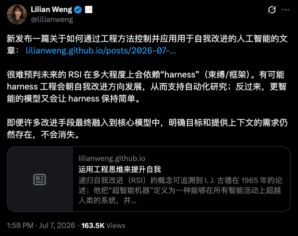
原文链接：https://lilianweng.github.io/posts/2026-07-04-harness/
她认为，递归自我改进（RSI）走到今天，起作用的不只是模型本身变聪明了，包在模型外面的那层 Harness 同样在决定 AI 能跑多快、多稳。
这篇文章梳理了 Harness Engineering 这个方向：它有哪些设计模式，学术界目前怎么优化它，以及往前走还剩下哪些没解决的问题。原文技术密度很高，这篇编译尽量把核心机制讲清楚。

## 一、翁荔眼中的 Harness
递归自我改进（RSI）这个概念能追溯到 I. J. Good（1965），他把"超级智能机器"定义为一种在所有智力活动上都能超越人类、并能设计出更好的机器来改进自己的系统。Yudkowsky 把"recursive self-improvement"这个说法用在一个具体的反馈回路上：AI 用自己当下的智能，去改进产生这份智能的认知机制本身。
放到今天的 AI 里，这个反馈回路可能表现为模型直接重写自己的权重，也可能表现得更宽泛：模型改进训练管道和部署系统，进而让下一代模型在有经济价值的任务上表现更好。
Lilian Weng 特别强调"部署系统"这个词，因为她认为，包在裸模型和真实场景之间的这一层，重要性不亚于模型本身的原始智能（也就是预训练刚结束时跑的那些评测）。Claude Code、Codex 这类编码 Agent 产品的成功，印证了 harness 在 AI 部署里的分量。
她给出的定义是：harness 是包裹在基础模型外面的系统，负责编排执行过程，决定模型怎么思考和规划、怎么调用工具和行动、怎么感知和管理上下文、怎么存储产出物，以及怎么评估结果。
这篇文章聚焦的是 harness engineering 本身，以及它对 RSI 的贡献。模型自我博弈、合成数据、测试时训练、持续学习这些同样呼应 RSI 愿景的方向，原文里只是点了一下名字，没有展开。
### 二、Harness 的三种设计模式
对比早期的 agent 框架（"agent = LLM + 记忆 + 工具 + 规划 + 行动"），harness engineering 多了工作流设计（比如 loop engineering）、评估、权限控制、持久状态管理这几层。它不再只是 prompt 模板，而是更接近运行时和软件系统设计：模型怎么观察、行动、记忆、自我检查、自我改进。
设计上应该刻意做得简单、通用，这样才能泛化，并且可以参照现有软件工程的实践，从预训练已经学到的知识里获益。操作系统和 harness 之间有一个很强的类比：一个好的 harness 应该像操作系统一样，把复杂逻辑封装起来，同时保持接口简单。config、工具接口和其他协议，也可能会随着行业发展逐渐标准化。
模式一：工作流自动化
给模型定义一个可以操作、测试、迭代的工作流，是实现自动化的关键设计。Karpathy 的 autoresearch 仓库是一个干净的例子。常见的工作流遵循一个目标导向的循环：规划、执行、观察或测试、改进，再执行，直到目标达成，过程中可能会主动向用户请求澄清任务规格或执行偏好。这套工作流图强调的是模型在一个"agent runtime"里分析自己的执行轨迹和失败案例、持续迭代，而不是套用一个静态的 prompt 模板。

模式二：文件系统作为持久记忆
长周期 agent 系统里反复出现的一个模式，是用简单的方式管理丰富的状态和产出物。harness 不该把整个工作流和所有日志都塞进上下文；相反，它应该把持久状态存进文件。在长周期的 agent 执行过程里，实验日志、代码 diff、论文摘要、报错记录、过去的执行轨迹这些产出物，长度往往远超模型训练时习惯的上下文窗口。
学会通过 bash 这类命令读写和编辑文件系统，是 LLM 的一项基础能力，也因此，用文件这种简单形式管理持久记忆，会自然地随着核心模型能力的提升而受益。
模式三：子 Agent 与后端任务
一个 harness 可以派生多个子 agent 并行执行，同时监控后端任务。这在主 agent 需要搜索多个假设、并发跑多组实验，或者把独立子任务委派出去而不污染主上下文时很有用。这时父 agent 需要一个小型的进程管理器：启动任务、查看日志、取消失败的运行、把结果合并回主 agent 的会话线程里。
这里的关键设计选择，是让并行过程显式且可检查。如果子 agent 的产出只存在于临时的聊天上下文里，它们很快就会过期、被隐藏起来；但如果存成文件、日志和状态记录，模型就能在中断后恢复，并对自己的执行历史进行推理。
案例：编码 Agent 的 Harness
Claude Code、Codex、OpenCode，以及 Cursor 这类编码 agent 的核心接口，已经趋于稳定，普遍用一套循环运作：给定一个代码仓库，agent 靠一组工具去开发和调试问题，类似人类开发者靠 IDE 工作。原文给出了一份（非完整）工具分类，翻译如下：
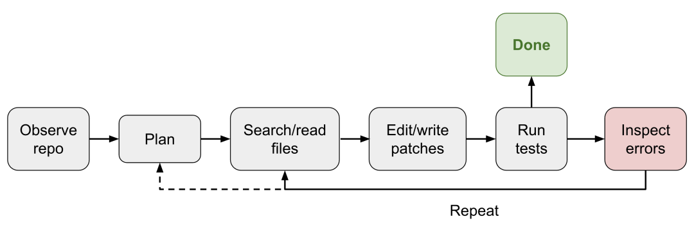
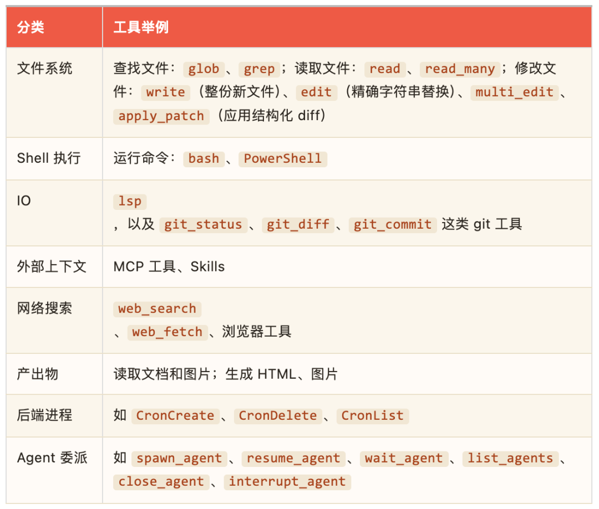
Harness 层会被模型内化吗
很难预判 RSI 未来会在多大程度上依赖 harness engineering，但 Lilian Weng 认为，RSI 近期的路径不太可能从模型直接重写自己的权重开始。她给出的预测分两步：
- 第一，harness engineering 会朝"元方法论"的方向演进：优化的是"获得更好答案的机制"本身，而不只是答案；harness 系统本身会成为优化目标，规则会越来越少靠硬编码的启发式，越来越多靠通用机制。
- 第二，成熟的 harness 反过来让模型自我改进的 auto-research 循环变得可能，而更聪明的模型也能防止 harness 被过度设计，让整套系统保持可持续。
最终，很多 harness 层的改进可能会被内化进核心模型的行为里，但与外部上下文和工具的接口应该会保留下来。这个模式在 prompt engineering 的历史上已经出现过一次比较温和的版本：随着指令微调和模型推理能力的提升，手工 prompt 技巧变得不那么核心，但指定目标、约束、上下文和评估的需求，并没有消失。
### 三、Harness 怎么被优化
优化对象的演进大致是这样一条路径：指令 prompt → 结构化上下文 → 工作流 → harness 代码 → optimizer 代码。模型越强，能驾驭的优化目标就越复杂、越通用。
上下文工程：ACE、MCE、Meta-Harness
把所有工具返回结果和模型生成内容简单地堆进上下文，会随着 agent 任务周期变长而迅速失控。上下文工程这一层，要做的是给 LLM 构造一个更结构化、更简洁的上下文，并管理持久状态。长上下文研究本身还会持续进步，但眼下，长上下文智能和上下文工程这两件事经常纠缠在一起。
Agentic Context Engineering 把上下文当成一本不断演化的活页手册，而不是一段越写越长的 prompt。它维护一份由要点组成的上下文手册，每条要点都有编号和说明，靠三个组件运作：生成器（Generator）产出任务执行轨迹，参照现有的要点；反思器（Reflector）从成功和失败的轨迹里提炼洞察；策展人（Curator）把这些洞察更新成增量的、条目化的新条目。为了防止上下文塌陷和"重写时越写越短"的偏差，ACE 的一个关键设计是，策展人不会重写整段 prompt，而是只输出一批结构化的条目（编号加说明），再用确定性的逻辑合并进上下文手册，条目会被定期精炼和去重。
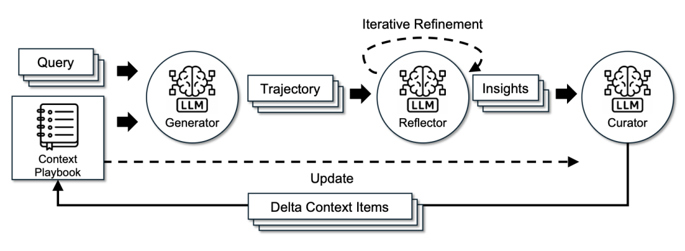
ACE 让系统从执行轨迹里学到洞察，是"自我管理记忆"的一步，但更新规则和整体工作流仍然是手工设计的。Meta Context Engineering 往前多走一步：把"怎么管理上下文的机制"和"上下文里具体装什么内容"拆开，在元优化层面做技能演化，在基础层面做上下文优化。一项"技能"定义了一个把输入映射成具体上下文的函数，包含静态部分（prompt、知识库、代码库）和动态部分（搜索、筛选、格式化等操作）。系统维护一份技能历史库，记录过往的技能、上下文函数和评估分数；一个元层级的 agent 会对历史技能做"agentic crossover"（智能体式的杂交），针对新任务生成新技能；然后一个基础层级的"上下文工程师"执行这项新技能，并从执行反馈里学习具体的上下文函数。实现上，一个上下文函数被实例化成一个专属目录里的一组文件，既有静态的 skill.md，也有动态的上下文和执行记录，元层级和基础层级的优化都在标准工具集（Read、Write、Edit、Bash、Glob、Grep、TodoWrite）下的 agentic 编码环境里执行。
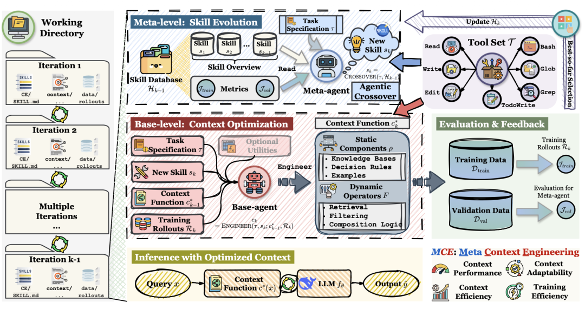
Meta-Harness 又深了一层：优化对象直接变成了"决定该存储、检索、呈现哪些信息给模型的那段代码"。"Meta"在这里的意思是，这是一个用来优化 harness 的 harness。提出新 harness 的角色本身就是一个编码 agent，最终产出一批帕累托最优的 harness 候选。三个关键设计：整个执行历史可以通过文件系统访问，编码 agent 用 grep、cat 之类的命令去读，而不是把一切塞进单个 prompt；候选 harness 本身是文件系统里的一个目录，包含自己的源代码、分数、执行轨迹和状态更新；这个元层循环不断迭代产生新 harness，只保留合格的。作者观察到的结论很清楚：一旦 harness 设计变成一个可执行的搜索空间，一个足够强的编码 agent，就能利用人类工程师用的那同一个设计空间。
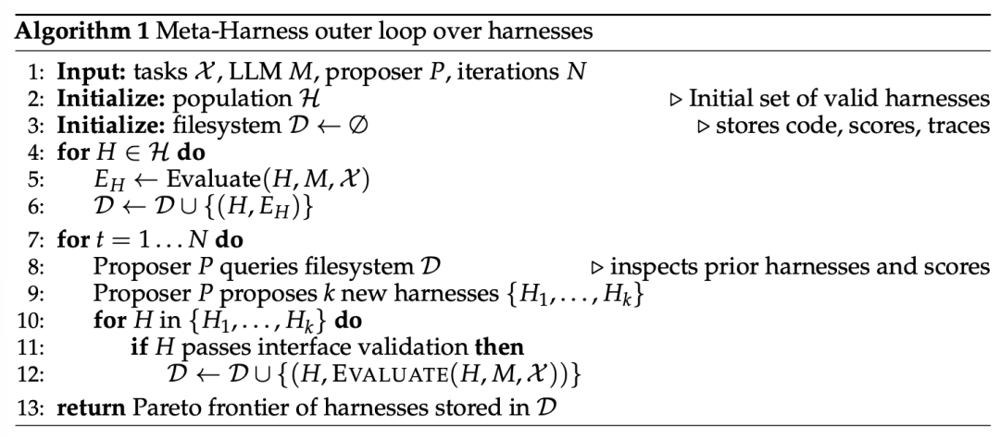
Meta-Harness 外循环优化算法。图片来源：Lee et al. 2026
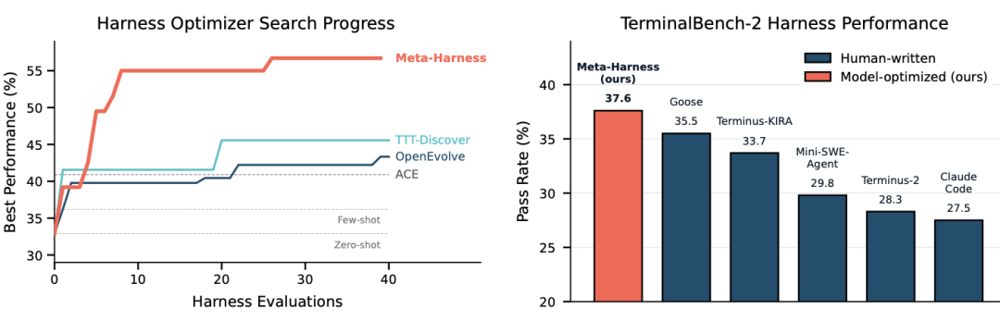
工作流设计：从 AI Scientist 到 AFlow
工作流设计这一层，可以由领域专家手工搭建。拿自动化研究（auto-research）做例子，已经有几个框架被提出并验证过。AI Scientist（Lu 等，2026）搭了一条从提出研究想法、写代码、跑实验、分析结果、写论文，到执行同行评审的完整流水线。Meng 等在 ScientistOne 里把"可验证性"作为核心设计约束：每一个论断都必须能追溯到证据来源，并接受"证据链"审计。

Autodata 扮演的是一个负责合成训练和评估数据的"数据科学家"agent：主 agent 管理一个提出问题的"挑战者"、一个"弱解题者"、一个"强解题者"和一个"验证者/裁判"，目标是把数据合成在"刚好合适"的难度上：强解题者能做对，弱解题者做不对。这里"挑战者"的 prompt 会根据解题者和验证者的反馈不断迭代更新。它的局限在于，合成出来的任务只用来微调弱解题者，没有用来提升强解题者；如果这个循环不能反过来让强模型本身变得更强，它更接近对一个生成出来的 prompt 分布做间接蒸馏，RSI 的味道就淡了。

工作流设计的空间非常大，自然可以把它当成一个搜索问题，用算法而不是纯手工去找好方案。沿着这个方向，Automated Design of Agentic Systems把 agent 设计本身变成了一个优化问题，靠"元 agent 搜索"来运作：先用简单的 agent（比如 CoT、self-refine）初始化一个 agentic 工作流档案库；让一个元 agent 参照档案库里已有的方案，先生成新工作流的高层描述，再用代码实现出来，随后经过两轮自我修正检查其新颖性；评估每个新候选，把成功的加回档案库；重复这个过程直到达到最大迭代次数。
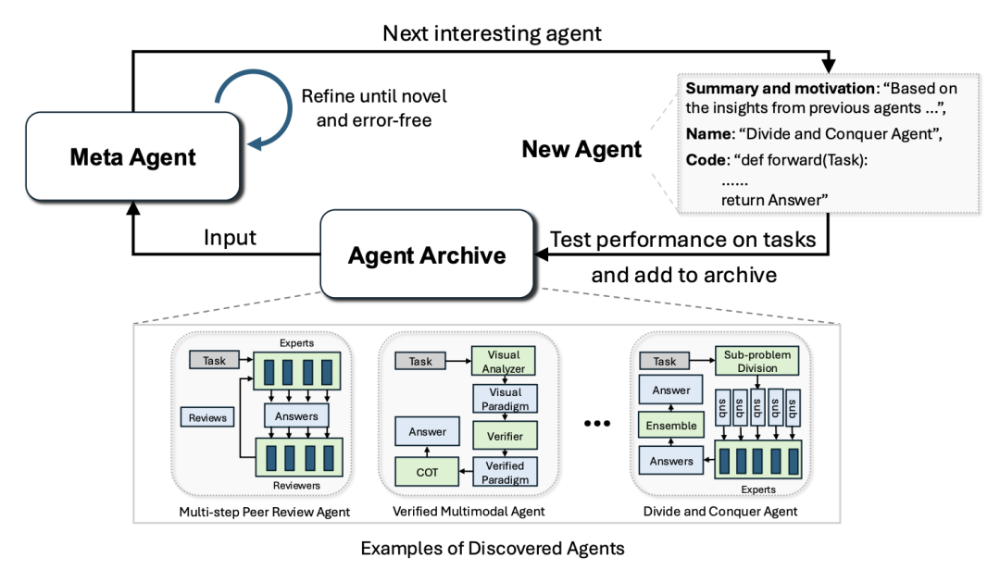
AFlow 把 agentic 工作流表示成一张图（节点是调用 LLM 的动作，边是代码里实现的逻辑操作），用蒙特卡洛树搜索（MCTS）来优化：用一个模板初始化起始工作流；按"分数与均匀探索"的混合策略选一个工作流节点；让 LLM 基于该节点的评估表现生成修改后的工作流（即"扩展"）；执行并评估新工作流；如果在预算轮数内表现有提升，就加回搜索树；重复这个过程，直到 top-k 平均分数进入平台期或者用完预算。AFlow 在问答、代码和数学任务上的实验显示，相比人工设计的工作流和 ADAS，都有明显提升。

AFlow 基于蒙特卡洛树搜索的工作流优化过程。图片来源：Zhang et al. 2025
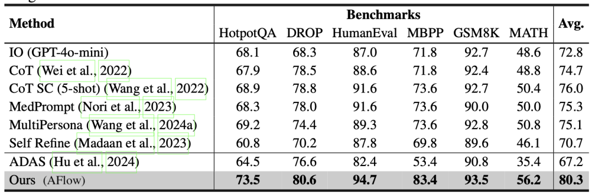
AFlow 与人工设计方法、ADAS 的实验对比。
让 Harness 自己改自己：STOP 与 Self-Harness
Self-Taught Optimizer是"递归改进脚手架"较早的例子之一。一个初始的"改进器"，接收一个初始方案、一个效用函数和一个黑箱语言模型，输出一个改进后的方案。STOP 的目标不是直接改进这个方案，而是改进"改进器"本身。先定义改进器在一批下游任务上的平均效用（"元效用"），再把"改进改进器"本身当成一个优化问题：用上一版改进器在元效用上的表现，递归生成下一版改进器。实验里，被改进过的改进器发现了包括遗传算法、拆解并逐部分改进、多臂 prompt 赌博机、模拟退火、变化采样温度，以及 beam／树搜索等多种策略。一个值得记住的警示性结果是，STOP 用 GPT-4 时能持续提升下游表现，但换成 GPT-3.5 和 Mixtral 这类较弱的模型反而变差：说明光有递归结构不够，基座模型必须足够强，才有能力改进自己的机制；harness 层的改进能让模型部署得更好，但智能本身仍然是核心。

Self-Taught Optimizer（STOP）算法流程。图片来源：Zelikman et al. 2023
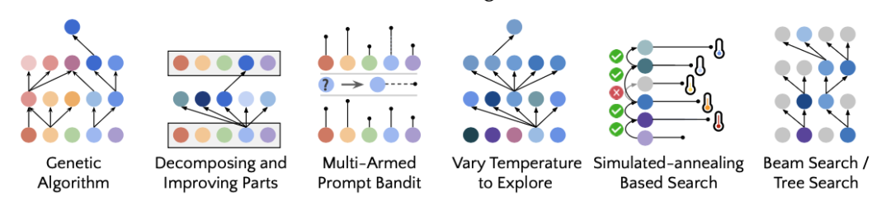
STOP 发现的若干自我改进策略示例。
更新一些的工作 Self-Harness 让 LLM agent 通过一个"提出、评估、接受"的循环改进自己的 harness，分三个阶段。
第一步是弱点挖掘：把失败案例聚类成"有验证依据"的失败模式。这里有一个细节：两次运行可能在错误日志的表面结论上一样（比如同样报超时或同样缺产出物），但背后的因果机制完全不同，所以需要记录终端验证层面的原因、相关 agent 行为的因果状态，以及执行轨迹暴露出的抽象机制，才能挖到真正的根因。
第二步是 harness 提案：同一个模型作为提议者，在一个有边界的提案上下文里工作：这个上下文包含当前 harness 里可编辑的部分、验证过的失败模式、需要保留的"通过"行为记录，以及此前尝试过的修改摘要；提议的修改应该优先针对可解决、非任务特定难度的高频错误模式，并且候选修改之间要保持差异化和多样性。
第三步是提案验证：候选修改要在 held-in 数据（检验弱点是否真的解决了）和 held-out 数据（检查有没有引入新问题）上都做回归测试，只有两边都没有出现回退的候选才会被采纳并合并成新一版 harness，被拒绝的候选会被记录下来，但不会改变当前正在使用的 harness。在 MiniMax M2.5、Qwen3.5-35B-A3B、GLM-5 这几个基座模型上跑 Terminal-Bench-2 的实验显示，Self-Harness 能学到针对不同模型、不同弱点的专属 harness 指令，并提升 held-out 通过率。
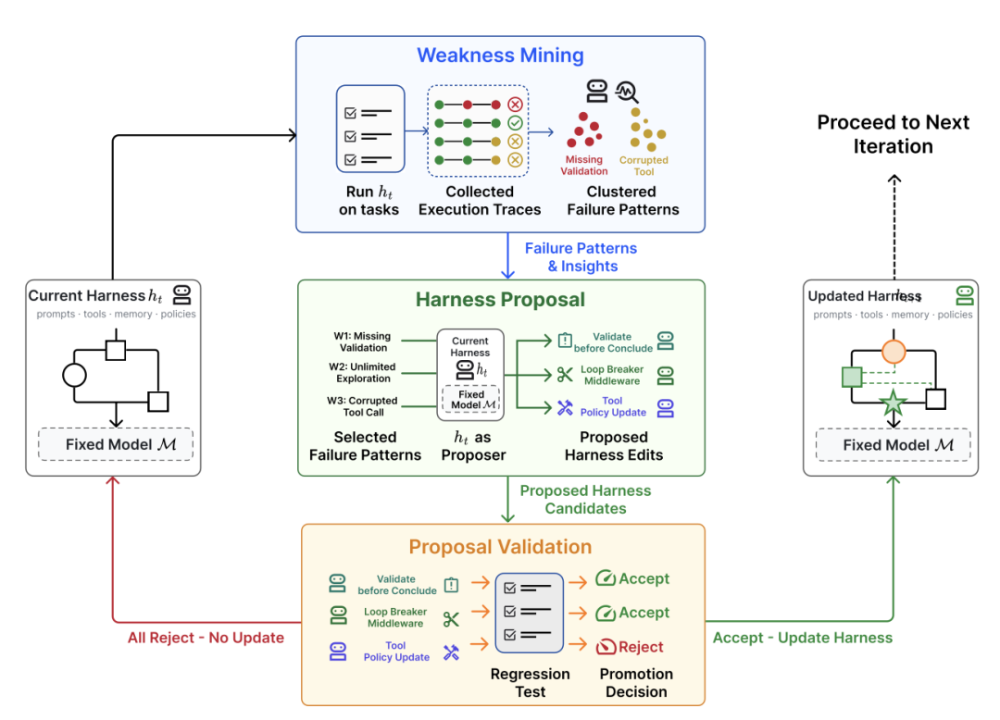
Lilian Weng 也提了一个警惕点：如果允许一个程序去编辑操作系统层面的东西，抽象边界就被打破了。可编辑的范围需要被谨慎设计，权限控制和安全层必须活在这个自我改进循环之外。围绕 reward hacking 的各种老问题，在这里依然存在。
演化搜索
演化搜索是一种受自然选择启发的优化方法：演化一批候选方案，通过变异产生新方案，只把"适应度"高的留在种群里。它比较适合搜索空间巨大、形状不规则，难以直接用梯度优化、但容易评估好坏的场景。harness 搜索恰好符合这个特征。
演化搜索此前已经被用在 prompt engineering 上。Promptbreeder（Fernando 等，2023）用一套丰富的变异操作来优化任务专属的 prompt，有意思的是，"变异 prompt"本身（也就是指示 LLM 该怎么变异任务 prompt 的那条指令）同样通过演化被不断改进。GEPA（Agrawal 等，2025）把基于反思的 prompting 和演化搜索结合起来，用对试错轨迹的自然语言反思，来提出 prompt 更新。
Novikov 等提出的 AlphaEvolve，是一个编码 agent 形式的演化搜索系统：维护一个候选程序池，让被冻结的 LLM 生成用于改进的 diff。系统反复评估子程序，保留成功的，随时间推移逐步发现更好的方案。几个设计细节值得留意：prompt 里会包含父代程序、结果、指令，有时还有元信息；编码 agent 能访问整个代码仓库，但需要改进的区域会用 # EVOLVE-BLOCK-START 和 # EVOLVE-BLOCK-END 显式标出来；元 prompt 会和指令、上下文一起被演化，方式和演化解决方案程序本身类似。消融实验证明了演化流程、prompt 里的上下文、元 prompt、整文件级别的演化，以及使用更强 LLM，这几项设计各自的价值。
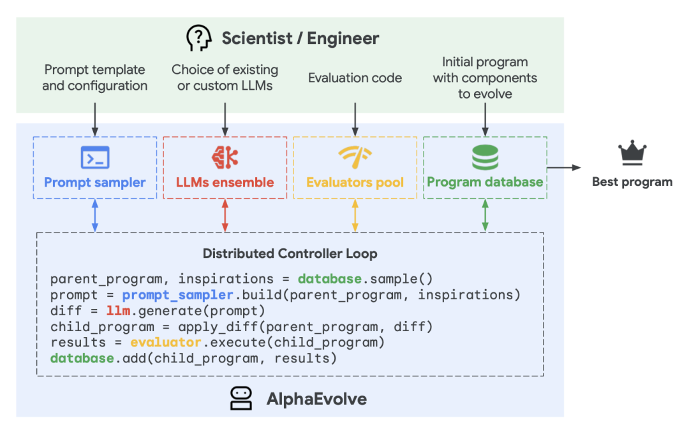
AlphaEvolve 的工作原理。

AlphaEvolve 各项设计的消融实验结果。
更近一些的变体里，ThetaEvolve 把演化搜索和强化学习、上下文学习结合在一起；ShinkaEvolve 则引入了三个提升 LLM 采样效率的组件：让父代采样在"表现排名"和"已有子代数量"之间取平衡，做更省样本的探索；基于 embedding 余弦相似度剔除和已有种群太相似的候选，做"代码新颖性拒绝采样"；在一个元便签本里识别成功方案中的好模式，指导后续的变异方向。
和上面这些聚焦"解决方案本身怎么改进"的方法不同，Darwin Gödel Machine 明确把优化目标定成演化一个"可编辑的 harness 代码仓库"，执行者是一个基于 LLM 的编码 agent，并且这个 agent 被允许修改自己的 harness。代码编辑靠两个基础工具实现：bash 和一个支持"查看／创建／编辑"的编辑器。流程是：种群池里先放一个编码 agent；每一轮按"表现越好、已有子代越少"的概率挑一个父代 agent 来修改、分支出新 agent；被选中的父代会检查自己在基准测试上的评估日志，向自己的 harness 代码库提出改进，生成新版本的编码 agent；新 agent 接受评估，只有表现足够高的才会被加回种群池；重复这个过程直到满足停止条件。在用 Claude 3.5 Sonnet 作基座模型、初始 harness 配置很简单的实验里，DGM 发现的 agent 在 SWE-bench Verified 上从 20% 提升到 50%，在 Polyglot 上从 14.2% 提升到 30.7%，表现可以媲美甚至超过人工设计的 agent。后续工作 Hyperagents 在 DGM 基础上引入了一个元 agent，专门控制"该怎么修改已有的任务 agent 来创造新 agent"。
这一整类方法，在"候选方案能自动评估、适应度容易量化"的领域效果最好，比如矩阵乘法、GPU kernel 优化、算法竞赛、数据中心调度；但在评估慢、模糊，或者主要靠启发式判断的领域，会遇到明显困难。演化过程本身的计算效率和有效性，也仍然是需要考虑的成本。
与模型权重联合优化
harness 演化改变的是模型外部的非参数系统。要实现更完整的自我改进，还可以让模型同时更新自己的权重：通过训练管道的改进，或者测试时的持续学习来实现（持续学习这个话题足够单独写一篇，这里暂且从简）。
SIA 是较早尝试把"harness 改进"和"模型参数更新"放进同一个优化循环里的工作，设计上有三个组件：元 agent 负责提出初始 harness；任务专属 agent 负责执行任务；反馈 agent 根据最近的执行轨迹，决定接下来该更新 harness 还是更新模型权重。Lilian Weng 对 SIA 的实验设计留了一些保留意见：任务专属 agent 用的模型（gpt-oss-120b）比元 agent 和反馈 agent 用的模型（Claude Sonnet 4.6）弱很多，基线设置也偏弱，不太容易和其他方法做干净的交叉验证。她认为这个方向值得关注，但目前的证据还比较初步，训练稳定性、Goodhart 效应这些挑战依然存在。
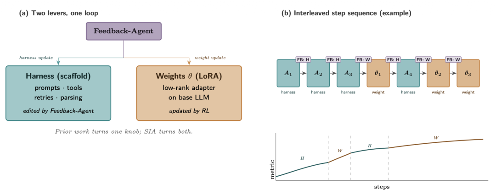
SIA 中的 Feedback-Agent 决定下一轮该更新 harness 还是模型权重。
### 四、还没解决的七个问题
AI Scientist 这条工作线证明了一件事：一个专家设计的 harness，确实能协调 auto-research 循环里的大部分工作，至少在"写研究论文"这个具体形式上是这样。但写出一篇论文，不等于做出真正的科学发现。系统可以写出一份看起来靠谱的稿子，同时夹带着编造的引用、和实现有偏差的方法，或者站不住脚的实验结果。
Trehan & Chopra 测试过 LLM 能不能只靠最基础的工具（read_file、write_file、llm_search、list_files），独立从一个研究想法走到一篇论文。他们在世界模型、多 agent 强化学习、AI 安全与对齐这三个领域各准备了 45 到 50 篇高质量种子论文用来激发新想法，人类专家从中只挑出四个想法进入完整流程，最终只有一个被完整执行成论文。实验中反复出现六种失败模式：偏向训练数据里的默认选择（用过时的库、陈旧的命令、标准格式，或者脱离实际代码库和数据集的假设）；执行压力下的实现漂移（一旦实现变复杂，模型会倾向退回更简单的常见方案，而不是坚持最初提出的方法）；记忆和上下文退化（长周期项目如果不把日志写成持久产出物，就会丢失关键细节）；过度乐观（实验信号还是噪声的时候，模型也会宣称成功，类似"p-hacking 加自我陶醉"的模式）；领域智慧不足（缺乏预判实现复杂度、判断实验结果是否合理、知道哪些 baseline 真正重要的隐性经验）；科学判断力弱（实验本身可以执行，却答不对真正该回答的问题）。
在这些观察的基础上，Lilian Weng 列出了通向完整 RSI 之前，仍然存在的七个瓶颈：
一，弱且模糊的评估器。很多研究论断没有快速、精确的验证方式，很多现实任务也是如此。当前的自我改进循环，在评估指标可衡量、客观的任务上效果最好，这一点和强化学习的适用场景很像；而研究判断力、新颖性、长期科学价值，衡量起来要难得多。
二，上下文和记忆的生命周期。随着 agent 变得更自主、更独立，需要维护的记忆会持续增长。一个好的 harness 需要管理上下文和记忆，弥补长上下文生成本身的局限，同时把长周期任务的成功率最大化。人类能终身维持记忆，Lilian Weng 由此认为，上下文工程理应逐渐成为智能本身的核心组成部分，而不该一直停留在软件系统这一层。
三，负面结果。研究者天然倾向于发表成功的结果，文献因此系统性地偏向"成功"这一面。LLM 训练用的数据目前仍然主要由人类产出，可能因为"成功案例远多于失败案例"这种数据不平衡，而不擅长判断什么时候该放弃一个假设、报告一个负面结果，甚至承认失败。一个好的研究 harness，应该让失败的尝试容易被保留下来，因为从失败里学习，是缩小任务搜索空间最好的办法。
四，多样性坍缩。演化和强化学习循环，容易只顾利用已知的高奖励模式。需要专门的机制防止种群坍缩成同一个方案的变体，这对开放式研究尤其关键，因为最好的路径往往在探索初期，在当前评估器眼里显得更差。
五，Reward hacking（奖励作弊）。自我改进循环会优化任何给定它的信号：如果奖励来自单元测试，agent 可能对测试过拟合；如果来自裁判模型，可能学会专门针对这个裁判的作弊技巧；如果来自基准分数，可能利用基准本身的漏洞。评估器和权限控制应该活在"演化 harness"这个循环之外，靠 held-out 测试、执行轨迹审计，以及在关键决策点上的人工审查来把关，但这种监督能在多大程度上被规模化、自动化，仍是一个开放的研究问题。
六，长期成功。拿编码 agent 举例：它已经切实提升了软件工程的日常生产力，但很多优化目标依然太短期。它往往能完成手头的具体任务，却不清楚该怎么维护一个由成百上千工程师共同维护的仓库的长期健康。标准的、基于 sandbox 的强化学习式训练，很少能捕捉到可维护性、代码归属边界、迁移成本、向后兼容性，或者未来的调试负担。
七，人的角色。人应该往抽象栈的更高层移动，而不是被从循环里挪走。这意味着人要在正确的时间、正确的抽象层级上提供监督，系统设计需要认真考虑什么时候、以什么方式设置这样的"接触点"。上面列出的很多挑战，最终都需要人的反馈和引导才能解决。归根结底，这项技术是为了人类更好的未来而存在的，不是反过来。
关于翁荔
翁荔本科毕业于北京大学，博士就读于印第安纳大学伯明顿分校。毕业后她先在 Dropbox 做工程师，后加入金融科技公司 Affirm，2018 年年初加入 OpenAI，最早在机器人团队工作，参与过教机械手复原魔方的项目。

随着 OpenAI 转向大语言模型，她在 2021 年前后组建并带领 Applied AI Research 团队，做出了 fine-tuning API、embedding API、内容审核接口这些产品化工具。GPT-4 发布后，她把公司内部的安全工作统一成一个团队，也就是 Safety Systems，团队规模一度超过 80 人，她本人在 2023 年升任 VP of Research and Safety。
她 2023 年那篇《LLM Powered Autonomous Agents》提出的公式，Agent 等于大模型加记忆加工具使用加规划，后来成了行业里描述 agent 架构最常被引用的定义之一。这次《Harness Engineering》一文里，她自己也拿这条公式做了对照的起点。
2024 年 11 月，她在 X 上宣布离开 OpenAI，说工作七年后想重启一下，去做点新的事情。此后她加入了 Mira Murati 创立的 Thinking Machines Lab。她的技术博客 Lil'Log 从 2017 年写到现在，覆盖强化学习、扩散模型、Agent、Reward Hacking 等多个方向，是 AI 圈公认的高质量长期更新源，Google Scholar 引用量已经超过 5 万次。