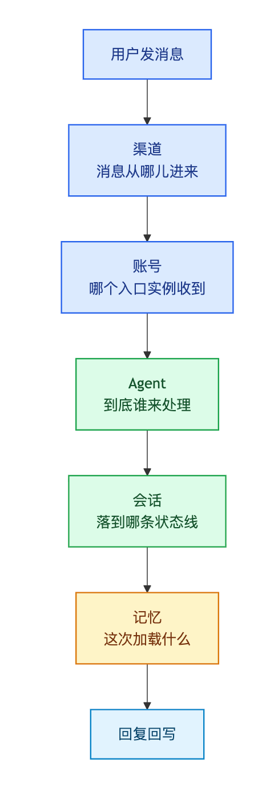
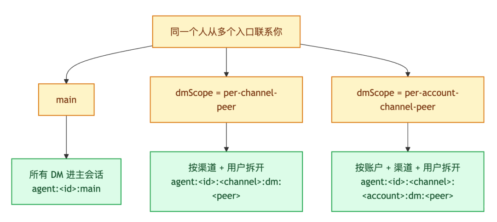

# OpenClaw 上手最容易搞混的 5 层关系：渠道、账号、Agent、会话和记忆

- **来源：** 微信公众号
- **作者：** 架构师（JiaGouX）
- **日期：** 2026-03-17
- **原文链接：** https://mp.weixin.qq.com/s/cXJDXisZRBB2vh3owBUa-Q

---

更贴近工程现场的说法是：**很多人不是不会用 OpenClaw，而是把几层本来分开的东西混在了一起。**
把它拆开看，OpenClaw 上手最容易搞混的，其实就是 5 层关系：
1. 渠道
2. 账号
3. Agent
4. 会话
5. 记忆
这 5 层一旦顺了，很多“它为什么不回”“为什么像没同步”“为什么像没记住”的问题，基本都会变得好排查很多。
今天不展开太深的源码细节，也不讲安全和复杂架构，先把最容易混在一起的 5 层关系理一遍。
先看一张更直观的分层图：

### 太长不看版（8 条）
1. **渠道**决定消息能不能进来。Telegram、WhatsApp、Discord、WebChat 都只是入口，入口没打通，后面都不用谈。
2. **账号**决定消息到底进到哪个 bot / 哪个接入实例里。同一渠道可以有多个账号，配错账号，消息可能根本没落到你以为的地方。
3. **Agent**决定谁来处理这条消息。一个 Gateway 后面可以挂多个 Agent，账号和 Agent 的绑定关系不对，消息就会“进来了，但不是这个智能体在处理”。
4. **会话**决定上下文沿着哪条线继续。OpenClaw 不是看“你在哪个聊天框里发言”，而是看消息最后落到了哪个 sessionKey。
5. **记忆**不等于“所有历史自动都能想起来”。主会话、群聊、长期记忆、短期记忆、历史会话，加载规则并不一样。
6. 很多“像没同步”的问题，本质上不是同步坏了，而是你切到了另一个渠道、另一个账号、另一个会话，或者根本不是同一个 Agent 在处理。
7. 很多“像没记住”的问题，本质上也不是模型突然失忆，而是这次上下文没有加载你以为会加载的那部分记忆。
8. 刚上手排查时，不要先怪模型，先按顺序看：**渠道 → 账号 → Agent → 会话 → 记忆**。
### 先别急着怪模型，很多问题都出在“层次混了”
如果把 OpenClaw 当成一个普通聊天机器人，很容易形成一种直觉：
- 我在哪个聊天框里发的，它就该在这个聊天框里继续记住
- 我换个设备，它就该像微信一样把所有状态同步过来
- 我配了一个机器人，它就该天然对应一个固定的智能体
但 OpenClaw 的内部逻辑其实不是这样。
我们可以把它看成“多通道 AI 助手运行时”。这句话听起来有点技术，但翻译成人话其实不复杂：
**你看到的是聊天入口，系统内部跑的是一套消息接入、路由、会话和记忆加载机制。**
所以它真正处理的不是“某个聊天框里的一段对话”，而是一条消息进入系统以后：
- 从哪个渠道进来
- 落到哪个账号
- 交给哪个 Agent
- 进入哪个会话
- 这次该加载哪些记忆
这 5 层一旦混在一起，体感就会很像“今天怎么又不对了”。
把它们拆开以后，很多现象其实都说得通。
   就像 openclaw仓库的 concepts/messages.md 强调的：一条消息真正经历的是**入站消息 → 路由/绑定 → 会话密钥 → 队列/运行 → 出站回复**，不是“某个聊天窗口里单纯追加一条历史”。
### 第一层：渠道决定“消息能不能进来”
这一层最基础，也最容易被忽略。
OpenClaw 可以接 Telegram、WhatsApp、Discord、WebChat 等不同入口。对用户来说，这些都是“我在哪儿和它说话”；对系统来说，这些首先是**接入层**。
接入层真正要回答的问题只有一个：
**消息有没有真正进到 Gateway。**
如果渠道本身没接好，或者你发消息的不是那个已经配置好的入口，后面账号、Agent、会话、记忆全都不会发生。
所以遇到“它怎么不回”，第一反应其实不用急着改 Prompt，也不用先怀疑模型。
先看两件事：
- 这个渠道本身有没有接通
- 我是不是发到了正确的入口
很多时候，“它不回”并不代表“模型没理解”，更常见的情况其实是：**消息根本没进来。**
这里还有一个很实用的细节。主仓的 slash-commands.md 讲得很清楚：像 /status 这种**独立斜杠命令**，会由 Gateway 直接处理，绕过队列和模型。
所以如果你怀疑“消息没进系统”，与其继续发普通聊天文本，不如直接试一下：
/status
比起反复发“你在吗”“怎么不回我”，它更像一个真正有用的排查动作。
### 第二层：账号决定“消息进到哪个接入实例”
渠道下面，往往还有一层账号。
比如同样是 Telegram，同样是 Discord，同样是飞书/企业入口，系统里完全可能同时挂着多个账号。
对我们来说，这些都长得像“一个机器人”；对系统来说，这些其实是不同的接入实例。
这一层一旦配错，很容易出现一种很典型的错觉：
- 你觉得消息已经进系统了
- 系统也确实收到了消息
- 但收的是另一个账号，不是你以为的那个
这时候用户体感就是：
- 为什么这个 bot 没反应
- 为什么我改了设置却没生效
- 为什么另一个地方突然收到了回复
所以第二步要确认的不是“有没有 bot”，而是：
**是不是正确的账号在接这个渠道的消息。**
对刚上手的人来说，这一层有点像“门牌号”。楼没找错，不代表门牌号就一定对。
### 第三层：Agent 决定“到底谁来处理”
这是 OpenClaw 和很多简单聊天机器人真正拉开差距的地方。
一个 Gateway 后面，不一定只有一个 Agent。你完全可以挂多个 Agent，让它们用不同工作区、不同配置、不同职责，各自处理各自的消息。
这里有个很关键的事实：
**消息进来了，不等于就是你以为的那个智能体在处理。**
如果账号和 Agent 的绑定关系没理顺，就会出现这些问题：
- 你以为这是“写作助手”在回，实际是“默认 Agent”在回
- 你以为该用这个工作区，实际系统走到了另一个工作区
- 你以为它应该知道你的上下文，实际它根本不在那条状态线上
这也是为什么很多“它怎么突然变笨了”的问题，最后查出来往往不是模型变了，而是**处理这条消息的 Agent 变了。**
所以第三步要确认的是：
**这条消息到底路由给了哪个 Agent。**
如果我们把这层想清楚，很多“为什么同样一句话，这次回得和上次完全不像一个人”的问题，就不会那么玄学了。
### 第四层：会话决定“上下文沿哪条线延续”
这一层最容易被误解。
很多人默认认为：我在一个聊天窗口里说的话，天然就会沿着这个窗口继续下去。
但在 OpenClaw 里，更关键的不是聊天窗口，而是**会话键**，也就是 sessionKey。
系统真正关心的是：这条消息最后落到了哪一条会话线上。
因为会话不只是“聊天记录”，它至少同时决定三件事：
1. 这次该接上哪段历史
2. 这条消息和别的消息要不要排到同一条线上处理
3. 这次运行结束后，状态写回哪里
所以我们会看到一些很典型的现象：
- 同一个人换个入口后，感觉像突然断片
- 群聊里说过的话，私聊里不一定自然接得上
- 明明聊过，另一个地方看起来却像“没同步”
这些问题很多时候并不是简单的“同步坏了”，而是：
**这次消息根本没落到你以为的那条会话线上。**
文档里有个配置特别关键，就是 dmScope。它决定直接消息到底怎么分组：
- main
- per-peer
- per-channel-peer
- per-account-channel-peer
如果是单人自用，main 往往更顺，因为连续性最好。
如果是多人收件箱，继续用 main 就很危险，因为不同发送者可能会共用上下文。这个场景下，更稳的做法通常是：
- per-channel-peer
- 或者 per-account-channel-peer
这一层其实记住一句话就够了：
**会话管的是状态边界，不只是聊天边界。**
这几种分组方式，用图看会直观很多：

如果你还遇到“为什么这一轮突然像换了一个新会话”的情况，主仓的 concepts/session.md 还给了另一组很实用的排查点：
- 会话是否触发了 /new 或 /reset
- 会话是否命中了每日重置或空闲重置
- 这次是不是线程、群聊或 topic，天然就该落到另一个键上
### 第五层：记忆决定“这次到底加载什么”
很多人把“记忆”理解成一个很笼统的东西，仿佛只要聊过，系统就应该永远能想起来。
但 OpenClaw 的记忆不是这么工作的。
更接近实际的理解是：
- 有些内容是每次都比较稳定会加载的
- 有些内容是按需加载的
- 有些内容只在主会话里加载
- 有些历史默认根本不会自动加载
这点可以通过OpenClaw的代码和文档,找到答案：会话和记忆都受上下文预算约束，历史也不是“有就全带上”。
尤其是非主会话、群聊和其他派生任务，本来就不会和主会话拿同一套记忆。
这也是为什么会出现另一类典型困惑：
- 我明明之前说过，为什么这次像没记住
- 我在主会话里教过它，为什么群聊里没用上
- 我明明有历史记录，为什么这次回答里完全没体现
从文档看，最容易先理解的几类内容大概是：
- 工作区里的核心规则文件
- 主会话相关的长期记忆
- 按需检索回来的短期/历史记忆
- 当前会话里实际能装进上下文的那部分历史
也就是说，**记忆不是“永久全量加载”，而是“按规则选择性加载”。**
所以“像没记住”并不总意味着它真的忘了，也可能只是：
- 这次不在主会话
- 这次没命中你以为会带进来的记忆
- 这次上下文预算不够
- 这次根本不是同一条会话线
这也是为什么“会话”和“记忆”一定要放在一起看，不能只看其中一层。
### 一张表，看懂“为什么它不回、为什么像没同步、为什么像没记住”
你看到的现象
更可能先看哪一层
典型原因
发消息不回
渠道 / 账号
入口没接通，或者发到了错误账号
同样的 bot 反应不对
Agent
路由到了另一个 Agent
换个入口后像断片
会话
没落到同一条 sessionKey
明明聊过却像没同步
会话 / 账号
不是同一会话，或者只是另一个入口视图
明明说过却像没记住
记忆 / 会话
这次没加载那部分记忆，或者根本不是同一条状态线
群里和私聊表现差异很大
会话 / 记忆
群聊和主会话的加载边界本来就不同
这张表想表达的意思其实很简单：
**不要一出问题就先怪模型。**
OpenClaw 这类系统，上层看起来像聊天，底层其实是接入、路由、会话和记忆一起在工作。
只要其中一层错了，用户体感就会很像“今天怎么又不对劲”。
### 刚装好 OpenClaw，我会怎么排查
如果是刚上手，我一般会按这个顺序看：
1. **先看渠道**
这条消息到底有没有真正进系统。
2. **再看账号**
是不是正确的入口实例在接。
3. **再看 Agent**
到底是谁在处理。
4. **再看会话**
这次是不是落到了你以为的那条状态线上。
5. **最后再看记忆**
这次加载的上下文，到底包不包含你想让它记住的东西。
如果想把这套排查做得更顺一点，主仓里的几个命令也很值得顺手记住：
- /status
先确认 Gateway 和当前会话运行态是不是正常。
- /new
明确开启一条新会话，避免把旧状态继续带着跑。
- /reset
在当前入口里强制切断旧会话，排查“是不是历史串了”时很好用。
如果是配置建议，我会给两个很朴素的思路：
- **单人自用，优先连续性。**
dmScope 可以先用 main，这样你跨入口时更容易接住上下文。
- **多人场景，优先隔离性。**
不要继续贪默认连续性，优先 per-channel-peer 或 per-account-channel-peer。
这两个思路看起来很简单，但或许能帮我们少掉很多“怎么今天又不对了”的问题。
### 写在最后
最近看到的很多龙虾相关的内容，很多都在讲“怎么装、怎么接、怎么初始化、怎么让它开始工作”。
这些内容当然重要，因为它们确实抓住了真实问题。
但如果再往前推一步，我们会发现 OpenClaw 真正最容易让人搞混的，不是某个单独配置项，也不是一句 Prompt，而是这 5 层关系本来就不该混在一起：
- 渠道
- 账号
- Agent
- 会话
- 记忆
**把这 5 层理顺，很多问题就不再像“玄学”，而会重新变成可解释、可排查、可配置的系统行为。**
理解问题背后的本质，以及对整个消息链路的理解，可能比一上来研究更深的架构细节更重要。OpenClaw 是怎么工作的？一条消息的旅程讲清楚
我们不一定都要造车，都要研究发动机，但是搞清楚车的主要原理，还是有必要的。
因为只有先把入口、处理身份、状态边界和记忆加载讲清楚，后面的多 Agent、上下文治理、队列模式这些能力，才更容易真正用顺。
### 往期相关推文
- 《OpenClaw 多 Agent 实战：从"单军作战"到"龙虾军团"》
- 《从误删邮箱到 Skill 投毒：OpenClaw 安全到底该怎么做》
- 《深入解析OpenClaw上下文窗口压缩：三层治理、配对修复与溢出恢复》
- 《Claude Code 最佳实践：架构、治理与工程实践》
- 《OpenClaw 是怎么工作的（2）：控制面两阶段协议与runId》
- 《OpenClaw 是怎么工作的（3）：会话键与队列策略，怎么把并发关进笼子》
OpenClaw 是怎么工作的（4）：三道闸门治理工具“副作用”，别让 Agent 把系统带跑偏
- 《OpenClaw 是怎么工作的？一条消息的旅程讲清楚》
《别把 OpenClaw 只当聊天机器人：为什么它更像一个作业系统》
如喜欢本文，请点击右上角，把文章分享到朋友圈
如有想了解学习的技术点，请留言给若飞安排分享
**因公众号更改推送规则，请点“在看”并加“星标”第一时间获取精彩技术分享**
**·END·**
相关阅读：
- CC核心开发者分享 | 构建 Claude Code 的经验教训：像 Agent 一样看世界
- 别让 Agent 只是"看起来聪明"：从 OpenAI 学到的 10 件事
- 跟Cloudflare大佬学用 Claude Code
- Claude Skills 入门：把“会用 AI”变成“可复制的工程能力”
- 一套可复制的 Claude Code 配置方案：CLAUDE.md、Rules、Commands、Hooks
- Claude Code 最佳实践：把上下文变成生产力（团队可落地版）
- 把 AI 当成新同事：Agent Coding 的上下文与验证体系
- Skill 到底是什么：从第一性原理深入剖析 Claude Agent Skills
- 把 Claude Code 用成工程工具：8 条黄金法则与一套可复用工作流
- Anthropic 官方 33 页指南拆解: 构建Skills的最佳实践
- 2026 开年这篇综述，把高效 Agents 讲得很工程（附落地清单）
- AI编程实践：从 Claude Code 到团队协作的 6 个落地抓手
### Anthropic 发布 2026 Agentic Coding 趋势报告：八大趋势与 4 个优先级深度解读
### Claude Agent Teams 架构与实战拆解
### Claude Code 创始人亲授：10 条进阶秘籍（附 12 条工作流 Prompt 清单）
