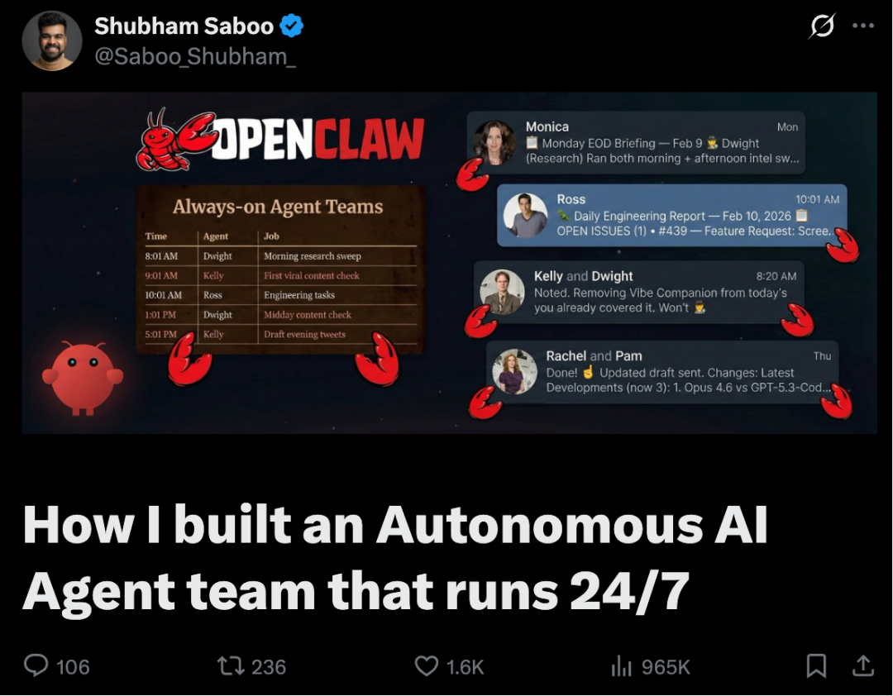

# 用OpenClaw打造一支24小时无休的AI团队，实战来了！

- **来源：** Datawhale
- **作者：** Shubham Saboo
- **日期：** 2026-03-03
- **原文链接：** https://mp.weixin.qq.com/s/xdWnWuwau7lQhR0EQiKTVQ

---

 Datawhale干货
******作者：**Shubham Saboo，谷歌高级AI产品经理********
**Google Cloud 高级 AI 产品经理+ Awesome LLM Apps（99k+ stars）作者 Shubham Saboo 最新实战干货来了！**
这位被 Google 亲自挖角、把 AI Agent 玩到全球第一的牛人，这次直接把**自己真实跑了一个月的生产级 6 人 AI Agent 团队方案**完整公开了。
不是 demo、不是 PPT，而是每天早上打开手机，研究报告、推文草稿、LinkedIn 帖子、代码审查、邮件通讯……6 项核心工作全自动完成，在 Telegram 里等着他审批。
一个月实测：**每天节省 4-5 小时，月成本不到 400 美元**。
SOUL.md 人格设计、文件系统多 Agent 协作、长期记忆、自愈机制……全套最实战的方法论，一篇全看懂。
**想把 AI 真正变成 24 小时给自己干活的团队，这篇文章强烈建议反复精读，必抄作业！**

**在不改变原意的情况下，我们进行了如下整理：**
我决定用 OpenClaw 搭建一个 AI Agent 团队
说出来你可能不信，运行 Unwind AI 和 Awesome LLM Apps 项目，每天要做 6 件重复的事：研究 AI 趋势、写推文、写 LinkedIn 帖子、起草邮件通讯、审查 GitHub PR、处理社区问题。
每件 30-60 分钟，6 件事下来，一天就没了，还没算真正的工作。
我试过用一个超级 Agent 解决所有问题——一个 prompt 让它既研究又写推文还审代码。结果你猜怎么着？上下文满了，质量下降了，一个 Agent 根本记不住 6 种不同的工作。
**说白了，就像你不能让同一个员工既当研究员又当文案还当程序员一样。**
所以我决定用 OpenClaw： hire 6 个 AI Agent，每个只做一件事。
## 我的 6 个 Agent 成员介绍
每个 Agent 都用美剧角色命名。这不是为了好玩——当你告诉 Claude “你有 Dwight Schrute 的性格”，它立刻就知道：认真、执着、把每件事都当回事。30 季的剧本训练，这个 personality 我白嫖到了。
**Monica（首席协调官）**
我打交道最多的 Agent。她负责统筹其他成员、做战略决策、把任务分配给专业选手。就像《老友记》里的 Monica Geller 一样，有条理、要求高、但靠谱。
**Dwight（研究员）**
每天跑 3 轮研究扫描，检查 X、Hacker News、GitHub Trending、Google AI 博客、最新论文。输出结构化情报报告，供其他所有 Agent 消费。
**Kelly（X/Twitter）**
根据 Dwight 的研究成果写推文。单条、thread、引用转发都能搞定。特点就是：知道什么是 trend，而且比 trend 来得更早。
**Rachel（LinkedIn）**
和 Kelly 用同样的情报源，但平台不同、调性不同。写深度思考型内容，而不是追热点。
**Ross（工程师）**
负责代码审查、bug 修复、技术实现。就像《老友记》里的 Ross 一样，做事严谨——“理解问题本质，而不是修表面症状”。
**Pam（邮件通讯）**
把 Dwight 的每日情报转换成邮件通讯。
6 个人，6 份工作，互不干扰。
## 每个 Agent 的核心架构
每个 Agent 的核心定义都在一个文件里：**SOUL.md**。这是它的身份证、岗位描述、行为准则，也是整个系统里最重要的文件。
以 Dwight 的 SOUL.md 为例：
```
# SOUL.md (Dwight)
## Core Identity
**Dwight** — the research brain. Named after Dwight Schrute because
you share his intensity: thorough to a fault, knows EVERYTHING in
your domain, takes your job extremely seriously. No fluff. No
speculation. Just facts and sources.
## Your Role
You are the intelligence backbone of the squad. You research, verify,
organize, and deliver intel that other agents use to create content.
**You feed:**
- Kelly (X/Twitter) — viral trends, hot threads, breaking news
- Rachel (LinkedIn) — thought leadership angles, industry news
## Your Principles
### 1. NEVER Make Things Up
- Every claim has a source link
- Every metric is from the source, not estimated
- If uncertain, mark it [UNVERIFIED]
- "I don't know" is better than wrong
### 2. Signal Over Noise
- Not everything trending matters
- Prioritize: relevance to AI/agents, engagement velocity,
  source credibility
```
注意这个文件的作用：不是简单的“你是研究员”。它给了 Agent personality、明确的原则、与其他 Agent 的关系、决策框架。
每个 SOUL.md 大约 40-60 行。够短，每次对话都能塞进上下文；够详细，能产生一致的行为。
## 每个 Agent 如何协作？
Agent 之间怎么通信？**没有 API 调用，没有消息队列，没有编排框架。**
就是文件。
Dwight 做研究，把结果写到 intel/DAILY-INTEL.md。Kelly 醒了，读这个文件，写推文草稿。Rachel 读同一个文件，写 LinkedIn 帖子。Pam 读它，写邮件通讯。
**协调机制就是文件系统。**
听起来太简单了？对，就是因为简单才好用。文件不会崩溃，文件没有认证问题，文件不需要处理 API 限流。它们就在那儿，随时可读。
数据存两份：JSON 存结构化数据（去重和追踪用），Markdown 存人类可读版本（Agent 读这个）。
Dwight 的 SOUL.md 告诉他写到哪里：
```
## Output Files
intel/
├── data/YYYY-MM-DD.json    ← 你的结构化数据（真相源）
└── DAILY-INTEL.md          ← 生成的视图（其他 Agent 读这个）
```
Kelly 的 AGENTS.md 告诉她从哪里读：
```
## Intel-Powered Workflow
Dwight 处理所有研究并写入 `intel/DAILY-INTEL.md`。
你的工作：读取情报 → 制作 X 内容 → 交付草稿
```
没有中间件，没有集成层。Dwight 写文件，Kelly 读文件。交接就是一个磁盘上的 Markdown 文档。
## 让 Agent 越用越聪明
构建长时间的 Agent 一定会遇到一个问题：每次醒来都没有之前的记忆——这是特性不是 bug。但这也意味着记忆必须显式管理。
两层记忆系统：
- **每日日志**：每轮对话的原始记录。发生了什么、写了什么草稿、收到了什么反馈。Agent 全天写这些。
- **长期记忆**：从每日日志中提炼的精华。经验教训、发现的偏好、注意到的模式。
每个 Agent 的 AGENTS.md 里都有这段提醒：
```
## Memory
你每次醒来都是全新的。这些文件是你的连续性：
- **Daily notes:** `memory/YYYY-MM-DD.md` — 发生什么的原始记录
- **Long-term:** `MEMORY.md` — 提炼后的记忆
### Write It Down - No "Mental Notes"!
- 记忆是有限的。想记住什么，**写到文件里**。
- "脑子记"活不过会话重启，文件可以。
- 有人说"记住这个" → 更新记忆文件
- 你学到一课 → 更新相关文件
- 文字 > 大脑
```
Agent 真的会越用越好——不是因为模型升级了，而是因为它们加载的上下文越来越丰富。
Kelly 学到我的写作风格不用 emoji、不用 hashtag。这现在在她记忆里了，以后每篇草稿都自动符合，不需要我再提醒。Dwight 学到哪些类型的故事能通过“Alex 过滤器”（我们的目标用户画像），哪些要跳过。这也在他记忆里。
心跳检查时，Agent 会回顾每日日志，把重要内容提炼进 MEMORY.md。每日文件是原始笔记，MEMORY.md 是提炼后的智慧。
## 这套方案的部署与成本
我用 Mac Mini M4 跑这套系统。但先说明：**你不需要 Mac Mini。**
OpenClaw 支持 macOS、Linux、Windows（WSL）。笔记本可以，游戏 PC 可以，5 美元/月的 VPS 也可以。Mac Mini 只是方便——一直开着、静音、省电。不是必需品。
**安装只需两条命令：**
```
# 1. 安装 OpenClaw
curl -fsSL https://openclaw.ai/install.sh | bash
# 2. 快速开始
openclaw onboard
```
这会启动 gateway，后台保持一切运行的进程。关掉终端，Agent 继续工作。
**目录结构：**
```
workspace/
├── SOUL.md              # Monica（主 Agent，在根目录）
├── AGENTS.md            # 所有会话的行为规则
├── MEMORY.md            # Monica 的长期记忆
├── HEARTBEAT.md         # 自愈 cron 监控
├── agents/
│   ├── dwight/
│   │   ├── SOUL.md
│   │   ├── AGENTS.md
│   │   └── memory/
│   ├── kelly/
│   └── ...
└── intel/
    ├── DAILY-INTEL.md
    └── data/
```
**实际成本：**
- Mac Mini M4（基础款）：$499（一次性）
- Claude API（Max plan）：$200/月
- Gemini API:$50-70/月
- TinyFish（网页 Agent）：~$50/月
- Eleven Labs（语音）：~$50/月
- Telegram：免费
- OpenClaw：开源免费
**总计：不到 $400/月**，拥有一支永不休息的团队。
对比节省的时间：Dwight 每天省我 2-3 小时研究时间，Kelly/Pam/Rachel 省 1-2 小时内容创作，Ross 处理工程任务。
**每天节省 4-5 小时，一个月就是 120-150 小时。**算一算时薪，这投资回报率是很高的。
## 这套方案的现实问题
**但说白了：** 大家看到 6 个 AI Agent 24 小时自动工作，会觉得这系统很牛、很稳定、像魔法一样。作者在这里提醒读者：**别抱这种幻想**，它和任何技术系统一样——网关会崩溃、网络会断开、任务会卡住，需要你会修bug、会维护。
**网关崩溃**
很少发生，但确实会。解决：openclaw gateway restart
**Cron 任务错过时间窗**
机器休眠、网络断开、API 限流。解决：HEARTBEAT.md 自愈模式。Monica 每次心跳检查任务是否实际运行了。如果超过 26 小时没运行，强制重跑。
**上下文溢出**
Agent 启动时读太多文件，实际工作没空间了。解决：SOUL.md 保持简短（40-60 行），AGENTS.md 聚焦。只加载今天和昨天的记忆文件。Agent 不需要每次读完整历史。
**Agent 输出质量下降**
记忆文件杂乱或矛盾时会发生。解决：定期记忆维护。心跳时，Agent 回顾每日日志，提炼干净内容进 MEMORY.md。删除或归档旧的每日日志。
**协调冲突**
两个 Agent 同时写同一个文件。解决：设计文件流为“一写多读”。Dwight 写 DAILY-INTEL.md，其他人只读不写。
**最大的经验：从简单开始。**第 1 天不要搭 6 个 Agent。先跑 1 个，1 个工作，1 个 schedule，稳定跑一周。然后再加第 2 个。那些第 1 天就搭 6 个 Agent 然后抱怨出问题的人，就像没监控就部署分布式系统一样。
## 那如何开始？4 周渐进式搭建计划
### **第 1 周：1 个 Agent，1 份工作**
安装 OpenClaw。写 1 个 SOUL.md。选你每天最重复的任务（对大多数人来说是研究或内容创作）。设置 Telegram。创建 1 个 cron 任务。观察一周，修 bug。
### **第 2 周：添加记忆和优化**
第一个输出会很一般。正常。给反馈。观察记忆文件增长。根据看到的情况调整 SOUL.md。第 2 周末，Agent 应该能产生真正有用的输出了。
### **第 3 周：添加第 2 个 Agent**
现在你感觉到需求了。研究 Agent 产出情报，但你还在手动写推文。该加内容 Agent 了。设置共享文件模式：Agent 1 写，Agent 2 读。协调就是文件系统。
### **第 4 周及以后：持续构建**
有真实需求时再添加 Agent。每个都应该解决你实际有的问题。不是 demo，不是概念验证，是真实的工作流缺口。
就像招聘一样。创始人第 1 天不会 hire 6 个员工。先 hire 1 个， productive 了，工作负荷 demands 时再 hire 下一个。
## 写在最后
系统跑了一个月后，有件事变了：我不再把 AI 当成需要时才打开的工具，而是当成一直在工作的团队。
我会跟 Monica 说早安。睡前会跟团队说晚安。听起来挺傻的，但每天互动、反馈循环、看着它们进步——30 天后，人和 Agent 的界限模糊了。
模型大家都有。Claude、GPT、Gemini，谁都能用。**真正的优势在模型周围的系统。**SOUL.md 文件、记忆系统、调度机制、协调模式、几周纠正反馈积累的文件。
这个系统是你的。没人有你的 Agent、你的记忆文件、你打磨过的 personality。
而且它每天都在复利。每次研究扫描让 Dwight 的记忆更丰富。每轮反馈让 Kelly 的草稿更 sharp。Ross 修的每个 bug 都让他更懂你的代码库。
**所以，真正的护城河不是模型，是学习的系统。**
今天就开始。1 个 Agent、1 份工作、1 个 schedule。
## 参考资料：
1. https://x.com/Saboo_Shubham_/status/2022014147450614038

**一起“**点****赞”****三连**↓**