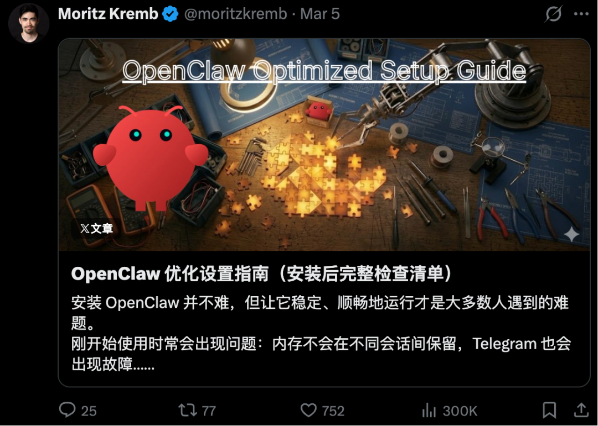
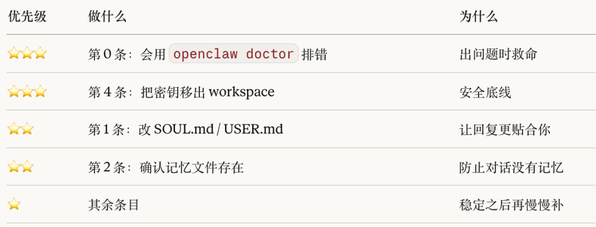

# 用OpenClaw之前，看这篇优化设置指南（完整清单）

- **来源：** Datawhale
- **作者：** Moritz Kremb
- **日期：** 2026-03-15
- **原文链接：** https://mp.weixin.qq.com/s/bfr61EI4Z1P0rKDH-mYhMQ

---

## 一、装OpenClaw很简单：稳定运行很难
装 OpenClaw 很简单，让它稳定运行才是大多数人卡住的地方。
刚开始用，各种问题接踵而来：记忆在会话之间无法持久化、Telegram 连不上、API 密钥直接扔在 workspace 文件夹里、Cron 任务悄无声息地停了……默认的模型配置看起来没毛病，直到某个周二深夜，你还在对着报错发呆。
AI 独立开发者、X 博主 Moritz Kremb 把自己踩过的这些坑，整理成了一份「装好龙虾之后要做的第一件事」。

只需一次 30～60 分钟的加固操作，就能把刚装好的 OpenClaw，变成真正扛得住日常使用的系统。
## 二、装好龙虾之后的第一件事
使用方式：按照优先级挑出对应的清单项，复制后，扔给你的小龙虾🦞，让它自己读懂、自己操作。

## 三、完整检查清单
### 1. 在其他一切之前，先把排错基础打好 ☑️
单独建一个 Claude 项目，专门用于 OpenClaw 的运维和调试，在里面挂上 Context7 的 OpenClaw 文档上下文，遇到问题直接在这里问。
安装 clawdocs 技能，让你的 OpenClaw 实例本身也能查文档。
**快速自检命令：**
```
openclaw gateway status
openclaw gateway restart
openclaw doctor（或 openclaw doctor --repair，情况比较诡异时用）
```
### 2. 个性化配置 ☑️
在 workspace 里更新以下文件：
- USER.md（助手服务的对象是谁）
- IDENTITY.md（助手的身份定位）
- SOUL.md（语气风格与行为准则）
**目标：** 从第一天起，让回复就有针对性、有主见、真正有用。
### 3. 记忆持久化 ☑️
确认长期记忆文件存在：MEMORY.md
确认每日记忆流存在：memory/YYYY-MM-DD.md
在 heartbeat 里加入指令，要求维护记忆文件，并将重要内容同步到 MEMORY.md
**heartbeat 记忆规则最低要求：**
当天文件不存在时自动创建
追加重要决策和经验
定期整理，将关键内容归入 MEMORY.md
### 4. 模型默认配置与备选方案 ☑️
**推荐默认组合：**
主力：openai-codex/gpt-5.3-codex（或 gpt-5.2）
备选：Anthropic / OpenRouter / Kilo Gateway 上的模型
**在以下位置配置：**
- **agents.defaults.model.primary**
- **agents.defaults.model.fallbacks**
- **可选：在 **agents.defaults.models.*.alias 里设置别名
**原则：** 先保稳定，再考虑成本。
### 5. 基础安全 ☑️
把所有密钥集中存在一个 env 文件里（放在 workspace **外面**），例如：~/.openclaw/secrets/openclaw.env
收紧文件权限：
文件夹：700
文件：600
如果跑在 VPS 上：只开放可信 IP 的入站连接，保持 gateway 鉴权 token 开启，不要把 gateway 暴露在公网
**加分项：**
开启 dmPolicy: "allowlist"
用 allowFrom / groupAllowFrom 限制 Telegram ID
### 6. Telegram 群组与会话优化 ☑️
**想接入群组的话，推荐如下配置：**
- **dmPolicy = allowlist**
- **groupAllowFrom = [你的 Telegram ID]**
- **group requireMention = false（如果想要主动发言行为）**
- **在 BotFather 里关闭 bot 隐私模式（获取完整群组上下文）**
- **把 bot 加为群管理员**
- **需要区分工作流时开启 Topics**
- **为有专属任务的 Topic 配置独立的 **systemPrompt
**通用建议：**
- **配置默认 ack 表情（比如 👀），可以看到消息已读**
- **开启流式响应**
### 7. 浏览器与搜索配置 ☑️
添加 Brave API 密钥，用于网页搜索和抓取
自动化操作优先使用 node/openclaw 托管的浏览器配置（隔离、稳定）
只有需要真实登录状态时才用 Chrome 中继（profile="chrome"）
**简单判断原则：**
自动化 / 日常工作 → 托管配置
需要个人会话 / Passkey → Chrome 中继
### 8. Heartbeat 与 Cron 加固 ☑️
在 HEARTBEAT.md 中添加：
检查关键 cron 任务的 lastRunAtMs，发现过期立即强制补跑
简要上报异常情况
这样能防止任务静默失败，保证日常自动化持续可靠。
### 9. 运营账号（Agent 专属） ☑️
为 Agent 环境单独创建以下账号：
Google 账号
邮箱（Gmail 或 AgentMail）
GitHub 账号
**原因：** 职责分离，权限更安全，操作更容易审计。
### 10. 技能积累策略
尽早安装 summarize 技能（高杠杆，值回票价）
把每个反复成功的工作流封装成本地自定义技能
搭建本地语音转录工作流（Whisper / OpenAI Whisper API），支持语音优先输入
**原则：** 一件事重复做了 2～3 次，就封成技能。
## 快速验收清单
- SOUL.md、USER.md、IDENTITY.md 已定制
- MEMORY.md + 每日记忆流正常运转
- heartbeat 包含 cron 检查和记忆维护
- 主力模型 + 备选模型已配置
- 密钥已移至安全 env 文件并设置严格权限
- Telegram 白名单 + Topic 提示词已配置
- Brave 密钥已设置；浏览器使用规则已确立
- 专属 Google / 邮箱 / GitHub 账号已创建
- summarize 技能 + 至少一个自定义技能已安装
**全部勾完，你的 OpenClaw 就不再只是"刚装好"——而是真正可以生产使用了。**