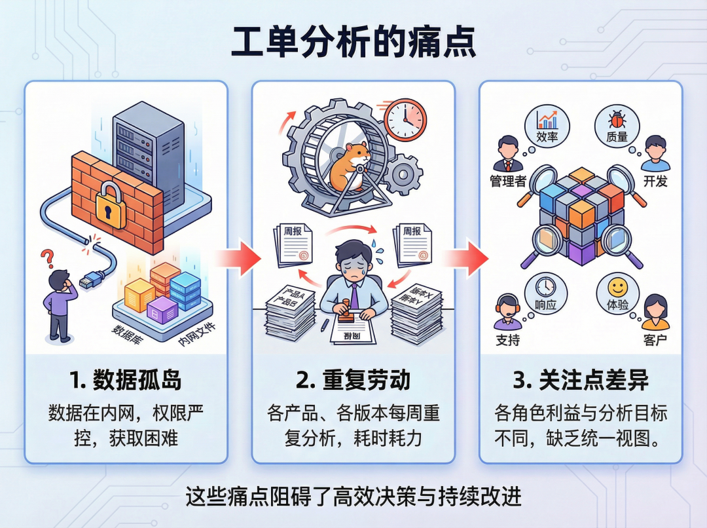
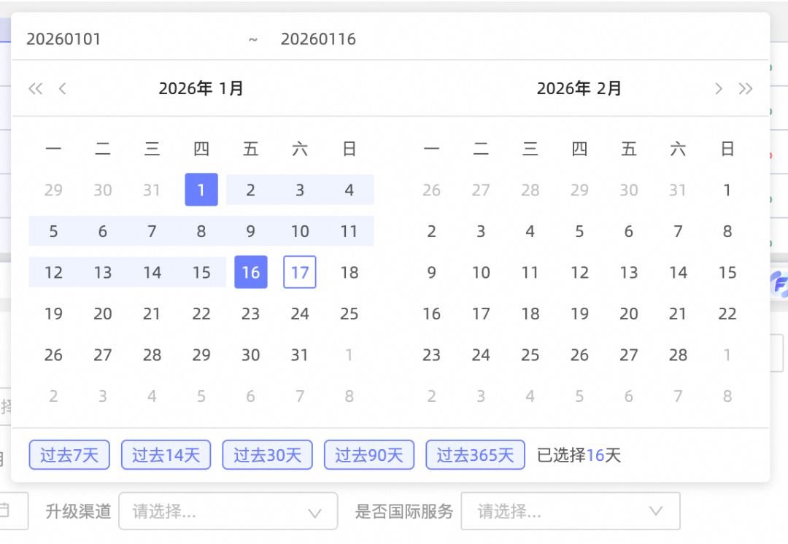
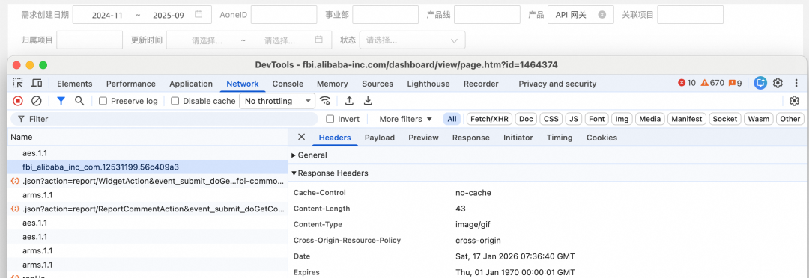
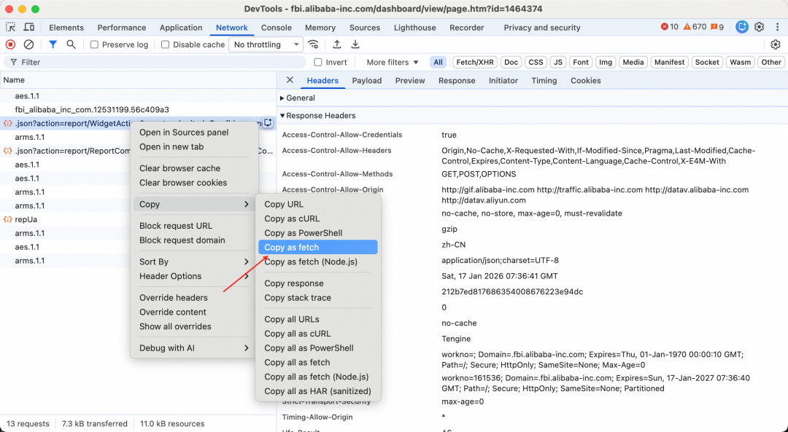
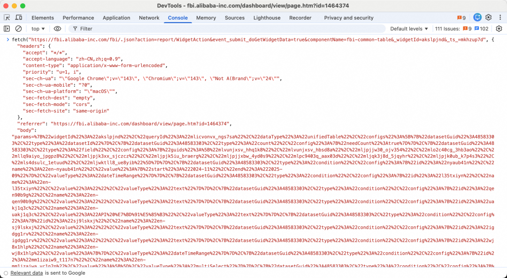
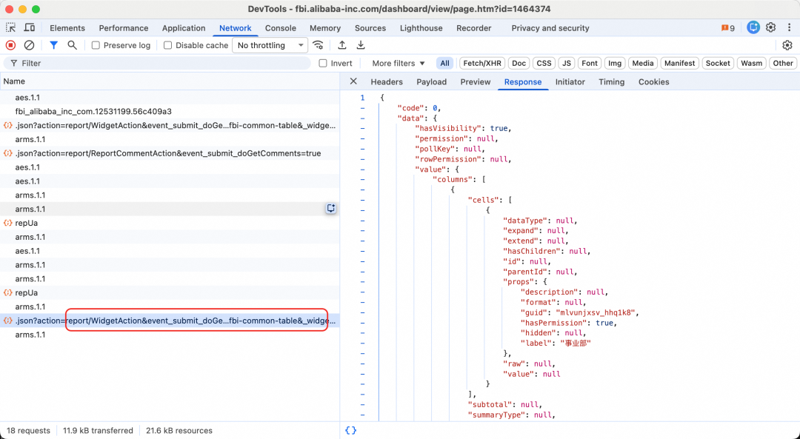
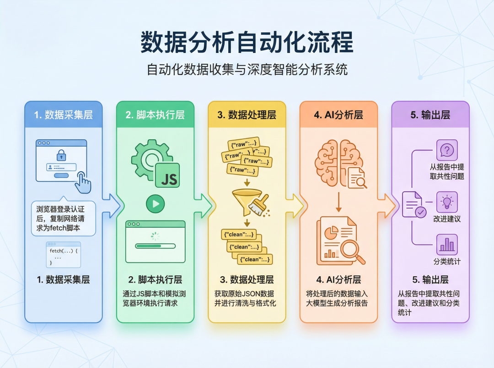
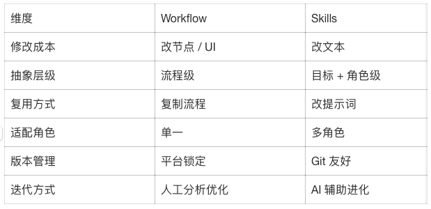

# Skills 真的可以帮我干活了：把工单分析变成一个可复用的 Skill

- **来源：** 微信公众号
- **作者：** 阿里云开发者
- **日期：** 2026-03-03
- **原文链接：** https://mp.weixin.qq.com/s/SQRUti3-j13yOyI6sCclcQ

---


Anthropic 刚推出 Skills [1]时，我非常兴奋。官方的态度也很明确：不要再执着于开发复杂 Agent，而是把精力放在 Skills 上。
但在认真研究了一圈官方和社区的 Skills 示例[2]后，我很快冷静下来—— 几乎没有一个 Skills 能直接在真实环境中跑起来。 当时我的判断是：这就是个玩具。
直到最近，Claude Code 2.1.3 版本[3]发布，将 commands 和 skills 进行了合并，解决了之前触发困难等问题。
特别是最近我关注的一位 AI 博主在介绍他的新项目时提到： 他最近最主要的工作就是帮企业把日常 SOP 沉淀成 Skills，一个 Skills 的收费高达五位数。
让我意识到 Skills 价值已经逐步在被证明。
一句话总结我接下来做的事情： 我把一个需要登录内网、手动筛选、导出、分析的工单 SOP， 固化成了一个可复用、易扩展、稳定运行的 Skills。
## 问题背景：为什么工单分析一直是痛点
最近一段时间，团队的产品的升级工单量明显上涨。 问题不在于"工单多"，而在于工单分析的复杂度。
工单分析有三个非常典型、也非常现实的特征：
1. 数据在内网 必须登录，且有严格的权限控制，无法通过公开 API 拉取。
2. 高频重复 每个产品、每个版本、每周都要重新做一遍。
3. 每个角色的关注点不一样 研发关心具体的技术问题，PD 关心提炼共性问题，产品化机会，TL 关心跨产品的横向对比。同一份数据，不同人要看不同的切面。

这恰好是 AI 非常擅长的事情，但前提是： 你得先把数据稳定地拿出来，还要能灵活适配不同角色的分析诉求。
注意：以下方案只讨论技术实现，不涉及任何数据安全或权限绕过问题。
## 传统思路的局限
无论是 Skills、Agent 还是 Workflow，本质都一样：拿到数据 → 交给模型分析。
真正的难点只有一个：如何在企业内网、强登录态的情况下，稳定、低成本地获取数据。
最自然的想法，是让 AI 帮我"操作浏览器"。但我很快发现这条路走不通。
**Playwright / playwright-mcp 的问题**
我最早尝试的是 playwright-mcp[4]，但很快遇到了几个致命问题：
1. Token 消耗极高 Playwright 需要生成大量页面 snapshot。
2. 稳定性差 页面中大量动态 DOM（例如时间选择器），元素定位极不稳定。

**agent-browser：**
**更适合 Agent，但问题依旧存在**
最近 vercel-labs 推出的 agent-browser [5]很火，5 天 7k star。 Rust CLI + 原生二进制，对 snapshot 做了大量优化，Token 消耗最多可降低 93%。
```
agent-browser open
agent-browser snapshot -i
agent-browser click @e1
agent-browser fill @e2 "text"
agent-browser close
```
但在实际使用中，我发现一个问题始终无法绕开：
只要是"让 AI 去操作页面"，行为就一定不稳定。
退回到"固定 selector + 脚本"的方式当然稳定，但代价是：
- 编写成本高
- UI 变更后维护成本极高
```
const browser = await chromium.launch();
const page = await browser.newPage();
await page.goto('http://example.com');
await page.locator('.submit').click();
await browser.close();
```
于是问题变成了：
能不能既稳定，又不需要维护复杂 UI 脚本？
## 关键观察：SPA 页面本质上只是接口渲染
现在绝大多数企业后台系统都是 SPA 架构。 页面上的数据，本质都来自接口请求。
比如一次简单的搜索操作，就会触发 Ajax 请求：

**我们做一个实验**
1. 在 Chrome DevTools 的 Network 面板中，对某个请求执行 Copy as fetch
2. 将代码粘贴到 Console 中直接执行


Network 面板可以看到，请求被完整复现：

**关键结论**
只要页面能正常渲染，就意味着对应接口在当前登录态下一定可复现。与其让 AI 学会"怎么点页面"， 不如让 AI 直接执行已经被验证过的请求。
新的解决方案：
## 新的解决方案：Copy as fetch + agent-browser eval
最终方案非常克制，也非常工程化：
1. 使用 agent-browser open 打开目标页面 （登录问题由用户自行解决）；
2. 在 DevTools Network 面板中 Copy as fetch，提前构造请求脚本；
3. 使用 agent-browser eval 执行该脚本，获取 JSON 数据；
4. 将数据交给大模型分析；
**流程图**

## Skills 实现
细节请查看源码 order-analysis-skill[6]
**目录结构**
```
order-analysis-skill/
├── scripts/
│   ├── check-agent-browser.sh
│   ├── check-cdp.sh
│   └── order-analysis.js
└── SKILL.md
```
**Skills 的关键价值**
这个 Skills 的核心不在于"分析工单"， 而在于：
它把"人类在 DevTools 里的隐性操作"， 变成了 AI 可以稳定执行的显性 SOP。
**SKILL.md 核心内容**
```
---
name: order-analysis
description: 分析产品升级工单，识别共性问题并提出产品改进建议。通过 agent-browser工具 访问工单系统，提取工单数据，进行问题分类、趋势分析和根因定位，输出改进方案。
---
## 核心工作流程
### 步骤 1: 前置检查
执行以下两个检查脚本，确保环境准备就绪：
```bash
# 检查 Chrome Debug 模式
sh scripts/check-cdp.sh
# 检查 agent-browser 工具
sh scripts/check-agent-browser.sh
```
**打开工单系统页面**
```
agent-browser --cdp 9222 open "https://inner.example.com"
```
**准备输出目录**
创建以时间命名的输出目录（格式：YYYYMMDD-HHMMSS）：
```
OUTPUT_DIR=".output/order-analysis/$(date +%Y%m%d-%H%M%S)"
mkdir -p "$OUTPUT_DIR"
```
**获取订单数据**
在浏览器中打开页面后，在同一 shell 会话中执行以下命令获取订单的所有JSON数据：
```
agent-browser --cdp 9222 eval "$(cat scripts/order-analysis.js)" > "$OUTPUT_DIR/order.json"
```
**分析数据**
针对获取的订单数据，识别共性问题并提出产品改进建议，并将分析结果保存到 $OUTPUT_DIR/order_report.md
agent-browser 使用方法
使用 agent-browser 进行网页自动化操作。运行 agent-browser --help 查看所有命令。
注意：所有 agent-browser 命令应加上 --cdp 9222 参数，例如 agent-browser --cdp 9222 open https://www.baidu.com/\
用法:
1. agent-browser --cdp 9222 open <url> - 访问指定页面
2. agent-browser --cdp 9222 snapshot -i - 获取可交互元素及其引用 (@e1, @e2)
3. agent-browser --cdp 9222 click @e1 / fill @e2 "text" - 通过引用与页面元素交互
4. 页面变化后重新执行 snapshot
```
## 延伸思考：Skills vs Workflow
正如[宝玉在他的文章](https://baoyu.io/blog/agent-skills-replace-workflow)中提到的：\*\*大部分 workflow 编排场景，都可以被 Agent + Skills 取代。\*\*
Workflow 很擅长 "跑固定流程"，有确定性——节点 A 执行完一定是节点 B。但它也有硬伤：
*   **不够灵活**：流程定死后，遇到输入变化就容易出错
*   **难以移植**：平台锁定效应明显，换个环境就得重来
*   **修改成本高**：改起来要小心翼翼怕影响其他节点
而 Skills 以 Markdown 格式存在，意味着使用者只需要用自然语言进行简单修改，就能满足各个角色的不同诉求。
### Skills 的灵活性优势
**1. 自然语言编排**
不需要拖拽节点，用自然语言描述流程。条件分支、并行执行、错误处理，都可以用自然语言描述，Agent 能理解。
**2. 可持续进化**
这是 Skills 相比 Workflow 最大的优势。发现提示词不够好？让 AI 帮你改。流程可以优化？随时调整。你的 Skills 会越用越好，而不是搭完就放在那儿吃灰。
**3. 版本管理友好**
Skills 是纯文本文件，可以用 Git 管理版本，可以代码审查，可以在不同机器间同步。
### 不同数据源诉求
比如我是负责 `API 网关` 的研发，我只对 `API 网关` 的工单感兴趣，对于其他的数据不关注，但是我的老板的视角可能不太一样，他需要看到每个产品的横向对比。关注的数据源就很不一样。
只需要修改一行：
```javascript
const productName = "API 网关";  // 改成其他产品名，或留空获取全部
```
**对于分析结果的不同诉求**
拿到数据后，不同角色对于数据的关注点不一样，比如我作为前端，更关注的是哪些工单是体验问题的；PD 更关注的是有哪些共性的问题，需要通过产品化来解决， 只需要修改 SKILL.md 中的分析提示词即可。

## 总结
通过这个 Skills，原本需要：
- 打开内网系统
- 多次筛选、导出
- 人工分析
现在变成了：
1. 一条命令触发 Skills
2. AI 自动完成数据采集与分析
3. 输出结构化分析报告
Skills 真正替换的不是"工作"，而是那些每次都要重新搭一遍的 SOP 脑力成本。
源码地址：order-analysis-skill
https://github.com/heimanba/order-analysis-skill
[1]https://platform.claude.com/docs/en/agents-and-tools/agent-skills/overview
[2]https://github.com/anthropics/skills
[3]https://github.com/anthropics/claude-code/releases/tag/v2.1.3
[4]https://github.com/microsoft/playwright-mcp
[5]https://github.com/vercel-labs/agent-browser
[6]https://github.com/heimanba/order-analysis-skill
