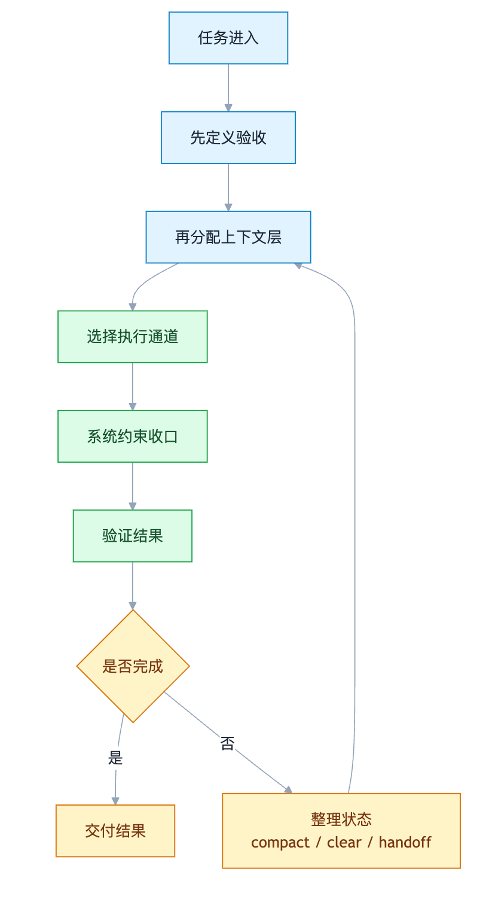
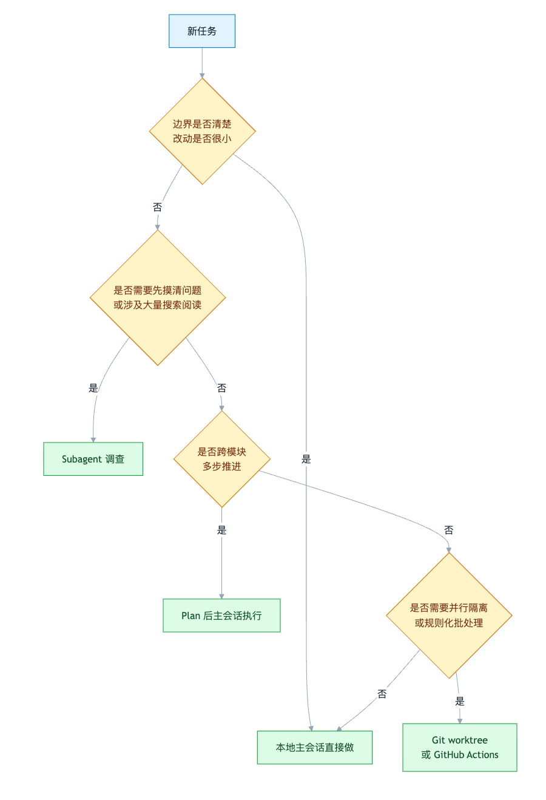

# Claude Code 最佳实践：一套可以每天照着走的默认工作流

- **来源：** 架构师（JiaGouX）
- **作者：** 架构师
- **日期：** 2026-03-15
- **原文链接：** https://mp.weixin.qq.com/s/fkz2SUfgYm09gJPjT2bjcw

---

最近这段时间，Claude Code 的文章很多。
有人在讲模型能力，有人在讲 Prompt，有人在讲 MCP、Skills、Hooks、Subagent。单看每一块都没问题，但真到了日常开发里，很多人卡住的地方并不是“不知道有这些功能”，而是另一件更朴素的事：
**一项任务到了 Claude Code 手里，到底该按什么顺序处理，才最不容易失控？**
我们前面几篇其实已经把这个问题拆到了不同层面。
《OpenAI 工程师不写代码了？拆开 Harness Engineering 看看他们到底在干嘛》讲的是验证闭环和仓库工程；《深入解析 OpenClaw 上下文窗口压缩》讲的是长会话治理；《Claude Code 最佳实践：架构、治理与工程实践》讲的是控制面分层；《Skills 详解：拆开一个真实技能看 Anthropic 和 OpenAI 的路线差异》讲的是按需加载的知识层。
这些判断放在一起看，会自然收束成一个更适合落地的问题：
**Claude Code 最佳实践，说到底不是技巧合集，而是一套默认工作流。**
本文不讲“功能清单”，而是试着给出一条更接近工程现场的链路：
任务进来之后，先做什么，再做什么，什么该常驻，什么该按需，什么必须交给系统硬约束，什么时候该继续，什么时候该清场重开。
### 太长不看版（10 条）
- **Claude Code 最大的问题，不是大家不会用，而是很多团队没有默认工作流。**
- **第一步不是写 Prompt，而是先定义“什么叫做完”。**
- **CLAUDE.md 不是百科全书，只该放常驻契约。**
- **memory、rules、skills、hooks 不是一类东西，混着用，系统就会失衡。**
- **小任务直接做，复杂任务先探索再 plan，高噪音调查交给 subagent。**
- **长会话不是“窗口够不够大”的问题，而是上下文噪音有没有被主动管理。**
- **提示词里的“请小心”不算约束，真正的约束要落在 hooks、permissions 和 sandbox。**
- **本地会话、worktree、GitHub Actions，分别适合不同阶段，放在不同通道里通常更稳。**
- **稳定的用法往往不花哨：目标清楚、验证明确、分层克制、会话干净。**
- **所谓最佳实践，本质上是在把 Claude 的自治能力，变成一套可复制的工程流程。**
可以先看看这个图,方便理解。

### 先把顺序排清楚
很多人一上来就做同一件事：往会话里猛塞背景资料，顺手再补一段长 Prompt，希望 Claude 一次把事情做对。
这套做法偶尔能成，但不稳。
因为 Claude Code 不是一个“回答问题的聊天框”，而是一个会持续收集上下文、采取行动、再根据结果继续推进的代理系统。它的问题，通常也不是“少了一句更聪明的话”，而是前面的顺序乱了。
我们在 前两天的《Claude Code 最佳实践：架构、治理与工程实践》里，已经把它拆成过任务循环、常驻契约、工作流层、动作层、控制层和隔离层六层。那篇更像总图。
现在, 我们往前走一步。
如果把那六层真正变成日常作业法，顺序大致应该是：
1. 先定义验收。
2. 再决定哪些信息该放进上下文。
3. 再选择执行通道。
4. 再用硬约束把风险动作收回来。
5. 最后才是长会话治理和阶段切换。
**顺序一旦乱了，后面每一层都容易替前一层背锅。**
表面看像是 Prompt 不够细，实际可能是验收没定义；表面看像是 Claude 不守规则，实际可能是规则放错了层；表面看像是上下文窗口不够长，实际往往是会话里塞了太多本不该常驻的东西。
用了一段时间之后，我越来越觉得一件事：
**Claude Code 要想用稳，与其先问“还能加什么能力”，不如先问“这件事应该按什么顺序做”。**
### 第一步：先定义验收，不要先堆上下文
如果只能留一条经验，我会留这一条。
**任务一进来，先写“什么叫完成”，不要先写“我知道这些背景”。**
这也是 Anthropic 官方文档和 OpenAI 那篇 Harness Engineering 文章，在底层上最一致的地方。前者在 Claude Code 的 common workflows 和 best practices 里反复强调 verification，后者则把“让 Agent 能验证自己的工作”当成整套 Harness 的起点。
道理不复杂。
没有验收标准，Claude Code 就只能根据语言描述去猜。猜对了，看起来很聪明；猜错了，返工很快就会累积。到最后它更像一个速度很快、但需要人持续盯着的实习生，而不是一个能自己闭环的代理。
我自己用下来觉得更稳的做法，是任务一进来就先把四件事说清楚：
1. **目标是什么**
  不是“帮我看看这个模块”，而是“定位登录失败的根因并修复”。
2. **什么叫完成**
  比如“相关测试全部通过”“页面截图和设计稿一致”“接口返回满足这三个字段约束”。
3. **用什么验证**
  测试命令、截图、日志、构建输出、性能指标，至少给一个能落地的验证手段。
4. **失败了先看哪里**
  比如“优先排查 auth middleware 和 token refresh 逻辑”。
这一步看起来很土，但收益很高。
Claude Code 最擅长的不是“凭空猜你的意图”，而是**在目标清楚、验收清楚的前提下，把一段流程跑通**。
就像前两天《 Harness Engineering 》里写过一句话：仓库必须同时是知识系统、规则系统、验证系统，也是回收系统。
今天再回头看，这句话其实也适用于 Claude Code。
如果仓库里没有测试、没有构建脚本、没有基本观测、没有可复现路径，Claude Code 当然也能写代码，但它很难稳定地知道自己是不是写对了。
任务入口更自然的顺序，不是“先把背景都贴进去”，而是：
- 先探索清楚任务边界
- 先写出 plan 或验收标准
- 再让 Claude 真正开始动手
这也是为什么 Plan Mode 该用，但不是每次都要开。
小改动、一眼能说清 diff 的事情，直接做更高效。
复杂重构、跨模块迁移、涉及多步验证的任务，先 plan 再执行，返工会少很多。
压成一句话就是：
**越是多步任务，越适合先把 plan 和验收写清楚，再让 Claude 动手。**
### 第二步：上下文放对地方
很多会话失控，不是因为窗口不够大，而是因为上下文放错了地方。
我们拆过《深入解析 OpenClaw 上下文窗口压缩》的文章里，是从长会话治理角度讲的。那篇的重点是：上下文问题从来不只是“历史太长”，更是“哪些信息该保真、哪些能压缩、哪些本不该常驻”。
放回 Claude Code，问题会更直接。
Anthropic 官方文档现在已经把这几层分得很清楚：CLAUDE.md、memory、.claude/rules/、skills、hooks，各自解决的是不同问题。混在一起，系统就会失衡。
下面这张表，可以直接当成日常判断基线。
层级
适合放什么
不该放什么
CLAUDE.md
构建命令、项目契约、目录边界、NEVER 清单、Compact Instructions
教程、背景资料、低频操作手册
memory
跨会话还会复用的稳定偏好、项目事实、长期约束
临时任务状态、一次性发现
.claude/rules/
路径级、语言级、目录级规则
全局通用说明
skills
低频但可复用的任务型工作流
每次都要加载的常驻规则
hooks
每次都必须发生的确定性动作
需要模型临场理解的复杂推理
这里面最容易被误用的，通常是 CLAUDE.md。
很多团队第一次治理 Claude Code，直觉动作都是“把经验都写进去”。结果这个文件越写越长，越写越细，最后自己先把常驻上下文污染了。
我自己的经验是，把 CLAUDE.md 当成协作契约就好，别当知识库用。
它更适合放每次会话都成立的东西，比如：
- 怎么安装、启动、测试、lint
- 哪些目录不能改
- 哪些规则必须遵守
- 压缩上下文时必须保留什么
别的内容，下沉到更合适的层里，通常会更稳。
这点如果从《Skills 详解》来看是对应的。那篇文章里我们写过，Skill 真正值钱的地方，不是“让模型更聪明”，而是把低频、可复用、可版本化的工作流从系统提示里拿出来，按需加载。
同理，memory 也不是上下文的回收站。
根据《2026 AI Memory 最新综述》，我们专门区分过 memory 和 context。前者是跨会话持久状态，后者是当前窗口里的工作区。
放到 Claude Code 里，这个区分尤其重要。
官方 memory 文档里已经把查找层级、项目记忆、用户记忆、以及 # 快捷写入都定义清楚了。它更适合保存那些“下次还应该知道”的稳定信息，而不是“这次任务做到第几步了”这种临时过程状态。
我现在的默认习惯是这样的：
- **常驻契约**进 CLAUDE.md
- **会跨会话复用的事实**进 memory
- **路径或目录特定规则**进 .claude/rules/
- **低频工作流**进 skills
- **必须每次都执行的动作**交给 hooks
**层放对了，上下文才会越来越干净。**
### 第三步：给任务选对执行通道
Claude Code 真正容易让人用乱的，不是规则层，而是执行层。
因为它现在能做的事情很多：本地会话里直接干、先 plan、开 subagent、配 worktree、跑 GitHub Actions。工具一多，如果没有一个默认路由，团队很容易什么都塞进同一个主会话里。
结果就是：主线程越来越吵，状态越来越脏，最后连最初的问题都开始看不清。
Anthropic 官方文档和 learn-claude-code 这套教学仓库，给了一个很清晰的共识：**不是所有任务都适合放在同一条执行通道里完成。**
可以把默认路由简化成下面这张分层图：

这里比较容易被低估的，是 subagent。
很多人第一次用 subagent，会把它理解成“并行助手”或者“多开几个 Claude”。但 Anthropic 官方文档和 learn-claude-code 的 s04-subagent 都在强调同一件事：
**Subagent 的核心价值，不是分工感，而是上下文隔离。**
也就是说，当需要扫很多文件、跑很多命令、做大量调查时，更合适的做法不是把这些输出都塞回主线程，而是让 subagent 自己跑完，再把摘要带回来。
这个判断和 Claude Code 最佳实践：可验证、可治理、可分层的工程现实 也一致。主会话更适合尽量保持干净，把高噪音调查和大体量探索隔离出去。
再往上一步，就是 worktree。
这也是 learn-claude-code 里从 task system 一直走到 worktree isolation 最值得借的部分。任务板解决的是“做什么”，worktree 解决的是“在哪做”。
两个不同任务如果还共享一个脏工作区，迟早会互相污染。
所以说, PRD 到底死没死？实现变便宜以后，评审吞吐会成为瓶颈。要想让多个任务并行，又不把状态搅乱，独立 worktree 几乎是最低成本的工程护栏。
最后还有 GitHub Actions。
Anthropic 官方已经把 review、triage、自动化协作这些流程拉到了 GitHub Actions 里。它更适合处理那些**不需要长时间人机来回沟通、但适合规则化批量执行**的工作，比如：
- PR review
- issue triage
- 定时检查
- 标准化修复和报告生成
所以，一个成熟团队的默认通道，通常不会只有“打开一个 Claude Code 会话”这一种。
更像是这样：
- **小改动**：本地主会话直接做
- **复杂任务**：先 plan，再执行
- **高噪音调查**：交给 subagent
- **并行任务**：放到独立 worktree
- **规则化批处理**：交给 GitHub Actions
**执行通道选对了，主会话才能保持专注。**
### 第四步：高风险动作，交给系统管
到这里，很多团队会开始犯一个老问题：把所有约束都写成文字提醒。
“谨慎修改配置。”
“删除前先确认。”
“改完记得跑测试。”
“不要碰这个目录。”
这些话在文档里当然可以写，但只靠这些话，系统并不会因此变得安全。
这也是为什么《从误删邮箱到 Skill 投毒：OpenClaw 安全到底该怎么做》会引起很多人共鸣。OpenClaw 安全,其实很适合直接搬到 Claude Code 上：
**提示词里的规则，不等于系统层的约束。**
Anthropic 官方在 Claude Code 文档里，对这一层的分工其实写得很明确：
- 如果 Claude 每次都应该知道它，放 CLAUDE.md
- 如果 Claude 有时需要，放 skill 或 rules
- 如果必须每次都发生，放 hook
- 如果某类能力根本不该碰，直接用 permissions 和 denylist 收回来
这套分工很值钱，因为它把“建议”与“强制”分开了。
特别是 hooks。
官方 hooks 文档已经讲得很清楚：hooks 适合处理那些**不能交给 Claude 临场发挥的动作**。而且匹配到的 hooks 可以并行跑，还支持异步 hook 和更灵活的事件触发。
翻译成工程语言，就是：
- 格式化
- lint
- 敏感文件保护
- 审计日志
- 固定通知
- 关键命令阻断
这些更适合交给系统，而不是依赖模型记性。
permissions 这一层也一样。
settings 文档里已经明确支持像 permissions.deny、disableAllHooks、目录范围、额外目录访问等配置。它的价值不在于“配置项很多”，而在于能把边界明确下来：
- 哪些能力默认不允许
- 哪些目录默认不开放
- 哪些动作必须阻断
- 哪些 hook 谁也别绕过去
这些才是真正的系统级约束。
日常用的时候，一个比较好用的自检方法是：
如果发现自己在 CLAUDE.md 里反复写“请务必”“记得”“不要忘了”，可以多问一句：
**这件事到底是提醒，还是本来就该被系统强制执行？**
如果答案是后者，它大概率更适合下沉到系统层去。
### 第五步：长会话要主动管，别等它自己乱
长会话治理这件事，很多人知道重要，但经常用错时机。
最常见的误区有两个。
一个是：会话已经乱了，才想起来 /compact。
另一个是：任务已经切换了，还舍不得清掉旧上下文。
这两种情况，说到底都是在拖延状态管理。
我们在分析 OpenClaw 上下文压缩时，其实已经得出过一个更一般化的结论：长会话要治理的，从来不只是“字数超限”，而是历史卫生、关键约束保真、失败恢复和阶段切换。
放回 Claude Code，最实用的其实不是理解底层机制，而是把几个动作用对。
### 什么时候该 /compact
适合这些场景：
- 当前阶段还没结束，但会话已经累积了很多工具输出
- 你还要继续同一个任务，只是需要把旧过程压缩一下
- 你希望保留关键状态，但不想让细碎历史一直占着窗口
可以把它理解成：
**任务还在继续，只是会话需要瘦身。**
### 什么时候该 /clear
适合这些场景：
- 任务目标已经切换
- 上一阶段的上下文对当前问题帮助不大
- 你已经能把关键状态收束成一份简短 handoff
可以把它理解成：
**不是清垃圾，而是主动切阶段。**
### 什么时候该先写 HANDOFF.md
适合这些场景：
- 任务跨度很大，要分阶段推进
- 你准备开新会话，但不想丢掉关键约束
- 需要把当前发现、未完成项、风险点交接给下一轮 Claude
这件事看起来有点笨，但用起来很踏实。
因为 handoff 的本质，不是复制聊天记录，而是把当前阶段真正重要的状态压成可复用的短文本。这个动作和我们前面讲的 memory、rules、CLAUDE.md 也能互相配合：哪些是下一会话必须知道的，哪些只是本轮过程噪音，写 handoff 的时候就会自然暴露出来。
### 什么时候该开新会话
更稳的标准其实就一句：
**当你发现当前会话里的大部分历史，已经不再服务当前目标时，就该开新会话了。**
Claude Code 的价值，不在于一条会话能拖多长，而在于每一轮活跃上下文是不是还干净。
### 最后: 默认作业法
如果把前面这些判断压成一条可以每天照着走的工作流，大概是这样的:
### 1. 任务进入后，先判断复杂度
- 小改动，直接做
- 多步任务，先 plan
- 高噪音调查，先 subagent
### 2. 开工前，先写验收
- 什么叫完成
- 用什么验证
- 失败先查哪里
### 3. 再分配上下文
- 常驻契约进 CLAUDE.md
- 长期事实进 memory
- 路径规则进 .claude/rules/
- 低频工作流进 skills
### 4. 再选择执行通道
- 主会话、subagent、worktree、GitHub Actions，各走各的
### 5. 高风险动作，不靠提醒
- 必须每次执行的交给 hooks
- 不该开放的能力直接 deny
- 把事故半径尽量收进 sandbox 和权限层
### 6. 过程中主动做会话治理
- 同任务继续但太臃肿，用 /compact
- 阶段切换或任务切换，用 /clear
- 大任务分阶段推进，先写 HANDOFF.md
这套顺序不花哨。但也正因为不花哨，日常协作里才真正能用起来。
它没有把希望全压在模型“更聪明”上，而是把任务入口、上下文入口、执行通道、系统约束和长会话治理，逐层做成了默认动作。
**默认动作一旦建立起来，很多“最佳实践”就不再像技巧，而会变成团队的日常。**
### 回到底层：这些步骤为什么是这个顺序
今天再次翻了  learn-claude-code ：
**Claude Code 最核心的东西，就是一个 ReACT 循环——LLM 思考一次，调用一次工具，拿回结果，再继续思考。如此循环，直到任务结束。**
用代码写，30 行 Python 就够：一个 while True，一次 API 调用，一次工具分发，一次结果回写。循环本身极其简单。
Claude Code 真正做的，是在这个循环上逐层叠能力：
问题
Claude Code 的解法
核心思路
只有一个工具不够
Tool Dispatch Map + MCP
加工具，不改循环
Agent 做事没计划，容易跑偏
Plan Mode / TodoWrite
先拆步骤，再动手
大任务塞满上下文
Subagent
给子任务独立上下文
知识全塞进 system prompt 太贵
Skill 按需加载
用到什么，再加载什么
上下文迟早会满
Context Compact
分层压缩，腾出活跃空间
回过头看，前面那套默认工作流，其实就是在顺着这个底层架构做事：
- **先定义验收**——让循环有明确的终止条件
- **上下文分层**——控制每次循环的输入质量
- **选择执行通道**——把高噪音任务隔离到独立的循环实例（subagent）里
- **系统约束收口**——在循环的 Action 层加确定性校验（hooks）
- **主动管理会话**——在循环持续运转时做上下文压缩和状态清理
**工作流不是外挂的流程规范，而是顺着 Agent 自身的运行机制，把每一层都用对。**
看清这层关系之后，很多看起来琐碎的“最佳实践”就不用死记了——你知道它为什么在那个位置、解决的是哪一层的问题。
### 顺便聊几个容易被忽视的细节
有一些很具体的数字和细节，平时不太被提起，但实际影响不小。
### 上下文预算的隐形消耗
Claude 的 200K 上下文窗口，实际可用大约 160–180K。差出来的部分，基本被系统指令、工具定义和常驻配置吃掉了。
一个典型的 MCP Server 可能带 20–30 个工具定义。5 个 Server 加一起，固定开销就可能吃掉约 25K tokens——你还没开口说话，预算已经先少了一截。
所以 MCP 不是接得越多越好。每多一个，都在压缩留给真正任务的空间。
### Prompt Caching 的取舍
Claude Code 底层大量依赖 Prompt Caching 来控制成本和延迟。规则很简单：
- 静态内容（系统提示、工具定义）放前面，锁定缓存
- 动态内容（当前时间、临时变量）放在用户消息里，别插进系统提示
- 会话中途切换模型，会导致缓存重建，反而更贵
我们在Claude Code 最佳实践：可验证、可治理、可分层的工程现实也提过：
不要让上层设计破坏底层缓存。这是 Claude Code 整个架构的底层逻辑之一。
### Skill 描述符怎么写
Skill 的描述符应该写“何时该用我”，而不是“我是什么”。
差距有多大？一个 45 tokens 的泛泛描述，和一个 9 tokens 的精确触发条件，模型的匹配准确率完全不同。越短越精确，加载越稳。
常见的三种 Skill 类型：
- **检查清单型**：发布前校验、PR 审查标准
- **工作流型**：配置迁移、故障排查（高风险操作建议加 disable-model-invocation: true）
- **领域专家型**：特定领域的知识和判断基线
低频 Skill 可以关掉自动触发，超低频的甚至更适合放成 AGENTS.md 文档，手动读取就行。
### 给 Agent 设计工具的几个坑
给 Agent 用的工具，重点不是功能多，而是“容易用对”。
一个常见的坑：需要中途向用户提问时，靠约定 markdown 格式让模型标记——Claude 会忘。更稳的做法是做成独立工具（比如 AskUserQuestion），让模型通过工具调用来触发。
另一个容易踩的坑：模型能力在持续变强。当初因为模型不够聪明而加的各种限制性工具和约束，可能反过来变成枷锁。定期回检工具列表，该松的松，该删的删。
### 配置健康度检查
如果不确定自己的配置合不合理，可以试试社区开源的 claude-health 工具：
```
npx skills add tw93/claude-health
```
在 Claude Code 里跑 /health，它会对 CLAUDE.md、rules、skills、hooks 各层做一次快速体检，输出优先级报告。不复杂，但能快速定位短板在哪。
### 写在最后
近期连着写了几篇相关文章，题目、领域各不相同，但回过头看，其实都是在讲一个思路:
从“知道有哪些机制”，变成“任务来了先怎么走”。
简单来说：
**Claude Code 的最佳实践，不是把 Prompt 写得更聪明，而是给它一条稳定的默认作业法。**
当验收先于行动，上下文各归其位，执行通道各走各路，系统约束替代口头提醒，长会话被主动管理时，Claude Code 才会真正从“能用”走向“能稳”。
如果把最近这组推文连起来看，本文和其他几篇的关系大致是这样的：
篇目
核心关键词
和本文的关系
《OpenAI 工程师不写代码了？拆开 Harness Engineering》
**反馈回路**
验证先行的工程基础——本文第一步
《深入解析 OpenClaw 上下文窗口压缩》
**长会话治理**
上下文分层和会话管理的机制底座——本文第二、五步
《Skills 详解：Anthropic 和 OpenAI 的路线差异》
**工作流沉淀**
上下文按需加载的设计原理——本文第二步
《Claude Code 最佳实践：架构、治理与工程实践》
**控制面分层**
六层模型的总图——本文将其收束为默认顺序
《PRD 到底死没死？编程 Agent 正在重写软件团队的流水线》
**顺序与评审**
执行通道分流和并行任务管理——本文第三步
**Claude Code 不是一个需要“发现秘诀”的产品，而是一个需要“把每一层用对”的系统。**
从底层循环到上层工作流，中间每一层都有明确的分工。看清这个分工，用起来自然就稳了。
### 参考资料
- Anthropic 官方文档：Claude Code Best Practices
https://code.claude.com/docs/en/best-practices
- Anthropic 官方文档：Common Workflows
https://code.claude.com/docs/en/common-workflows
- Anthropic 官方文档：Memory
https://code.claude.com/docs/en/memory
- Anthropic 官方文档：Settings
https://code.claude.com/docs/en/settings
- Anthropic 官方文档：Hooks
https://code.claude.com/docs/en/hooks
- Anthropic 官方文档：Subagents
https://code.claude.com/docs/en/sub-agents
- Anthropic 官方文档：GitHub Actions
https://code.claude.com/docs/en/github-actions
- Anthropic 官方文档：Security
https://code.claude.com/docs/en/security
- shareAI-lab/learn-claude-code
https://github.com/shareAI-lab/learn-claude-code
- tw93/claude-health
https://github.com/tw93/claude-health