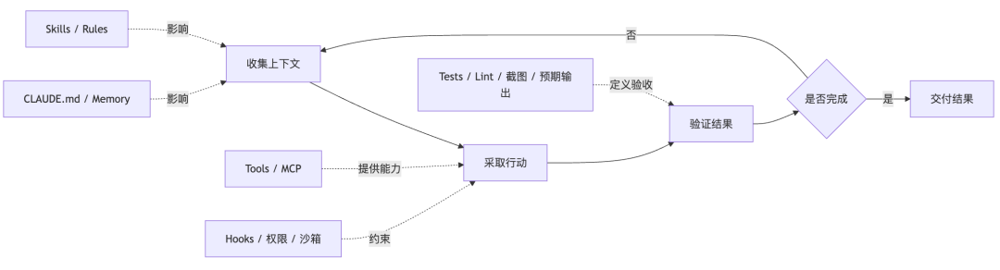
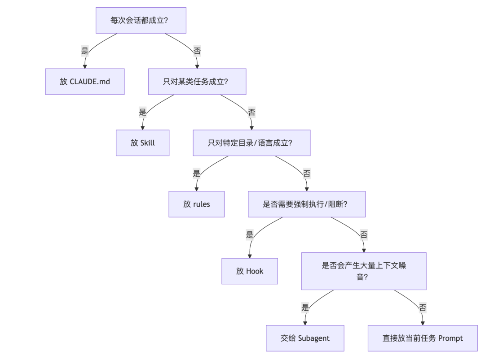

# Claude Code 最佳实践：可验证、可治理、可分层的工程现实

- **来源：** 微信公众号
- **作者：** 架构师（JiaGouX）
- **日期：** 2026-03-13
- **原文链接：** https://mp.weixin.qq.com/s/Suhxzr-KUw78RPTU6nn1gA

---

最近两三个月，Claude Code 的讨论明显变多了。
有人把它当成“会写代码的聊天框”，一上来就猛堆 Prompt；有人给它接一堆 MCP、写很长的 CLAUDE.md、再配十几个 Skill，结果用着用着就发现：会话越来越乱，规则越来越不听，工具越来越多，但结果反而更不稳定。
如果只看表面，很容易把问题归到模型能力上。但用得越多越会发现，更接近工程现实的结论其实是：
**Claude Code 的核心难点，从来不只在 Prompt，而在于你有没有把它当成一套“可验证、可治理、可分层”的代理系统来用。**
这篇文章就想把这件事讲清楚。它适合三类人：
- 刚开始用 Claude Code，觉得“怎么和普通聊天不太一样”的人
- 已经接了不少工具，但感觉效果忽上忽下的人
- 想把 AI Coding 从“个人玩具”带到“团队工作流”的人
如果你最近连续看了我们这组文章，这篇其实也可以看成一次“收束”——从 Harness Engineering 的反馈回路，到架构师责任上移，到 Skills 工作流沉淀、上下文窗口治理、Agent 安全三层防线，再到 AI 记忆系统的分层设计——这些线索合起来看 Claude Code，很多问题会清楚得多。
### 太长不看版（10 条）
- **Claude Code 是代理式编码环境，不是回答问题的聊天机器人。** 它的主循环是“收集上下文 → 采取行动 → 验证结果”。
- **很多质量问题不是模型不聪明，而是上下文太吵。** 冗长的 CLAUDE.md、过多 MCP、失控的工具输出，都会把真正重要的信息淹掉。
- **“验证”应该放在第一位，不是保守，而是工程现实。** 没有测试、脚本、截图或预期输出，Agent 很容易写出“看起来对、其实没法交付”的结果。
- **控制面一定要分层。** 常驻约束放 CLAUDE.md，低频知识放 Skills，硬性校验放 Hooks，大体量探索放 Subagents。
- **Plan Mode 不是每次都要开。** 复杂重构、迁移、跨模块改动先规划；一眼能说清 diff 的小改动直接做。
- **MCP 和 Skills 不是越多越好。** 固定上下文开销是真成本，尤其在大仓库里，会直接挤压可用思考空间。
- **Prompt Caching 决定了很多设计取舍。** 不要让上层设计破坏底层缓存，这是 Claude Code 整个架构的底层逻辑。
- **仓库本身也得升级。** 它不只是代码存放处，还得逐步变成 Agent 可读取、可验证、可纠偏的知识系统与规则系统。
- **主动管理上下文，别等系统自己处理。**/clear、/compact、HANDOFF.md、双击 ESC——这些很土的操作，本质上是在管理状态。
- **真正稳定的用法，往往都很朴素。** 给清楚目标、给可执行验证、控制上下文噪音、把约束放到正确的层里。
### 它和聊天框不是一回事
如果你把 Claude Code 当成“一个更强的 ChatBot”，很多误解从第一步就开始了。
Claude Code 不只是等你提问然后回一句答案。它可以读文件、跑命令、改代码、调用工具，还会在你给定的边界里自主推进任务。换句话说，它面对的是一段会持续演化的任务过程，而不是单纯的一问一答。
更贴近工程的说法是，Claude Code 的主循环大致长这样：

这张图里最容易被忽略的一环，其实是“验证”。
很多人上手 Claude Code 时，注意力都放在前半段：怎么写 Prompt、怎么配技能、怎么接工具。但真正重要的第一条偏偏是“给 Claude 一种验证其工作的方式”。原因很简单：**只要验收标准不明确，Claude Code 就会变成一个看起来很能干、但你必须全程盯着返工的实习生。**
放到我们在《OpenAI 工程师不写代码了？拆开 Harness Engineering 看看他们到底在干嘛》那篇里的说法，就是：**仓库必须同时是知识系统、规则系统、验证系统，也是回收系统。** Agent 能不能稳定，不只取决于模型强不强，也取决于仓库有没有把“该看什么、该怎么做、做完怎么验、出错怎么回退”写成结构。
比如你让它“修复登录错误”，这句话的信息密度其实很低。更有效的方式是：报出症状、指出可能范围、给一个可复现的失败用例，再要求它修完跑测试验证。前者更像模糊聊天，后者才是工程任务。
所以第一层心智模型要先校正：
**Claude Code 最擅长的是：在清楚目标和清楚验收的前提下，把一段可执行流程跑通。**
### 先把这套系统拆开看
只盯着 Claude Code 的某一个点，很容易得出片面的判断。
比如有人觉得问题都出在 Prompt，不断加规则；有人觉得工具越多越强；也有人把希望都放在 Subagent 或 Hook 上。可真到长任务、复杂仓库、多人协作这些场景里，单独强化某一层，系统通常不会更稳，只会把别的问题放大。
把它拆开看，通常更容易理解。一个更贴近工程现场的拆法，大概是这六层：
1. 任务循环：收集上下文、采取行动、验证结果
2. 常驻契约：CLAUDE.md、Memory、项目禁区和构建命令
3. 工作流层：Skills、rules、可复用的执行顺序
4. 动作层：Tools、MCP、CLI、外部系统接入
5. 控制层：Hooks、权限、沙箱、审批和审计
6. 隔离层：Subagents、并行调查、长任务分流
这六层里，最容易被忽略的是“平衡”。
CLAUDE.md 写太长，常驻上下文先被自己污染；工具堆太多，模型连该选哪个都要先花成本；Subagent 开得到处都是，状态开始漂；验证这层一旦跳过，最后出了问题，往往连问题出在哪一层都说不清。
换句话说，Claude Code 不太像一个单点能力产品，更像一套会互相牵动的系统。看懂它，通常不是去找“最强技巧”，而是先看哪一层承担了不该由它承担的事情。
### 真正先失控的，往往是上下文
很多人把上下文问题理解成“窗口不够长”，但实际更常见的问题是“窗口太吵”。
这两个问题看起来很像，治理思路却完全不同。
Claude 的 context window 会很快被文件内容、工具输出、会话历史填满，窗口一旦逼近上限，效果就会下降。把这个问题拆开看，大致可以分成工程上更有操作性的几层：
- 固定开销：系统指令、启用的 Skill 描述符、MCP 工具定义、LSP 状态
- 半固定开销：CLAUDE.md、Memory
- 动态开销：对话历史、文件内容、工具输出
这里最值得工程师警惕的是前两层，因为它们是“你还没开始干活，预算已经先花掉一部分”。
一个典型 MCP Server 可能带来 20 到 30 个工具定义，5 个 server 加在一起，固定开销就可能吃掉两万多 tokens。在小项目里不一定明显，但一旦进入“大仓库 + 多文件 + 多轮修改”的场景，这个代价就会被放大。
问题到这里还没结束。
很多团队第一次治理 Claude Code，最自然的动作是把经验都塞进 CLAUDE.md。结果往往是：
- 这个文件越写越长
- 规则越写越细
- 但 Claude 真正遵守的比例反而越来越低
更克制的做法是：CLAUDE.md 只放每次会话都成立的东西，其他低频或局部知识交给 skills；而且每加一条，都应该问自己一句“删掉它会导致 Claude 犯错吗”。如果不会，就别放。
背后的逻辑其实很简单。
**常驻上下文更像缓存预算，不是知识库。**
你把它写成百科，它就会变成噪音源。
这和我们在《深入解析 OpenClaw 上下文窗口压缩》里拆过的结论也能对上。长链路 Agent 遇到的从来不只是“历史太长”，而是窗口预检、历史卫生、配对修复、压缩重试、失败恢复这一整条治理链。Claude Code 虽然实现细节不同，但面对的是同一类问题：**上下文不是越多越好，关键是哪些信息该常驻、哪些该按需加载、哪些必须在压缩后保真。**
所以 Compact Instructions、/compact、/clear、HANDOFF.md 这些做法看起来琐碎，实际上都在做一件事：防止关键约束在长会话里漂移。
下面这个分层，基本可以当成 Claude Code 的上下文治理总原则：
层级
应该放什么
不该放什么
CLAUDE.md
构建命令、禁用事项、项目契约、必须遵守的边界
大段背景资料、低频操作手册、领域教程
rules
路径级、语言级、文件类型级约束
全项目通用规则
skills
任务型工作流、低频但可复用的领域知识
每次会话都要加载的常驻规则
hooks
硬性校验、审计、阻断、确定性脚本
复杂语义判断、多步推理
subagents
大量探索、并行研究、高噪音调查
强依赖共享中间状态的小任务
这套分层一旦不清楚，最常见的结果就是“什么都往一个地方堆”。堆到最后，Claude Code 往往不是不会做事，而是分不清现在最重要的是什么。
### 为什么要先强调“验证”
很多人第一次认真研究 Claude Code 的最佳实践，会觉得有点意外：怎么第一条不是 Prompt，不是 Skill，也不是 MCP，而是验证？
这其实说明，看 Claude Code 更应该用工程系统的视角，而不是聊天产品的视角。
几个非常典型的例子：
- 改函数时，直接给测试样例和成功标准
- 改 UI 时，给截图，让它做视觉对比
- 修构建错误时，要求解决根因，不要只压错误
这些建议表面上是“怎么提需求”，本质上是在补一件事：**让 Agent 拥有可闭环的反馈。**
这背后的逻辑和我们之前聊过的判断是一致的：AI 一旦开始吞掉实现环节，人的价值会自然往验证、观测、约束、回滚这条链条上走。Claude Code 的最佳实践，基本也在重复这件事。
如果没有这层反馈，Claude Code 的工作方式通常会退化成这样：
1. 它先根据你的描述做一个看起来合理的修改
2. 它无法确认自己到底修对没有
3. 你再人工发现问题，重新描述
4. 它基于新的描述继续猜
这更像反复试错的对话，而不是一个能自我闭环的 Agent。
所以在 Claude Code 里，“验证”更适合前置到任务设计阶段。开工前把这三件事说清楚，后面通常会省很多事：
1. 什么叫完成
2. 用什么命令或证据验证
3. 失败后先查哪里
这也是为什么“先探索，再规划，最后编码”这个节奏很重要。因为复杂任务一旦没有前置验证和边界确认，Agent 很容易在错误假设上持续修改，越改越远。
Plan Mode 的价值也在这里。它不是为了显得流程更正规，而是把“探索”和“执行”切开，避免还没想清楚就开始动文件。对复杂重构、迁移、跨模块改动，这个节奏很值；对只改一行文案、加一句日志、重命名变量这种小事，反而没必要。
**工程上成熟的用法，是根据任务复杂度调整控制强度。**
### 把控制面拆开，Claude Code 才会稳定
也可以把 Claude Code 看成两层：
- 上层是“模型怎么思考”
- 下层是“系统怎么约束它”
大家平时聊得最多的是上层，真正决定稳定性的，很多时候是下层。
一个很简洁的分工原则：
**给 Claude 新动作能力，用 Tool 或 MCP；给它一套工作方法，用 Skill；要隔离高噪音任务，用 Subagent；要强制执行和审计，用 Hook。**
这几个东西看起来都像“扩展能力”，其实分工非常不同。
### 1. CLAUDE.md 是协作契约，不该写成百科全书
它更适合写得短、直接、可执行。
例如：
- 项目用什么命令启动、测试、lint
- 哪些目录不能改
- 哪些规则必须遵守
- 压缩上下文时必须保留哪些信息
如果里面已经塞进了大段教程、领域背景、操作手册，通常可以拆出去了。那部分更适合放到 skill supporting files，或者干脆放文档里按需读取。
一个比较稳的 CLAUDE.md 骨架，大概长这样（建议控制在 2–3K tokens 以内）：
```
# Project Contract
## Build And Test
- Install: `pnpm install`
- Dev: `pnpm dev`
- Test: `pnpm test`
- Lint: `pnpm lint`
## Architecture Boundaries
- HTTP handlers live in `src/http/handlers/`
- Domain logic lives in `src/domain/`
- Do not put persistence logic in handlers
## NEVER
- Modify `.env`, lockfiles, or CI secrets without explicit approval
- Remove feature flags without searching all call sites
- Commit without running tests
## ALWAYS
- Show diff before committing
- Update CHANGELOG for user-facing changes
## Compact Instructions
Preserve:
1. Architecture decisions (NEVER summarize)
2. Modified files and key changes
3. Current verification status (pass/fail commands)
4. Open risks, TODOs, rollback notes
这里有个小技巧很实用：每次纠正 Claude 的错误后，让它自己更新 CLAUDE.md——"Update your CLAUDE.md so you don't make that mistake again." 用久了确实越来越少犯同样的错。不过也要定期 review，时间一长总会有些条目慢慢过时。
### 2. Skills 解决的是“怎么做一类事”
Skill 最容易被误用成“超长 Prompt 模板”。但实际用下来，一个好 Skill 更像工作流入口：
- 什么时候该调用我
- 这件事该按什么顺序做
- 输入和输出分别是什么
- 什么时候该停
还有一个非常现实的点：**Skill 描述符会常驻上下文。**
所以 description 越精确越好，不必一味追求完整。高频任务可以保留自动触发；低频、高副作用任务，最好显式触发，必要时关闭自动调用。
《Skills 详解》那篇里我们讲过，Skill 真正解决的是提示词漂移。把它翻成更工程的话，就是：**Skill 的价值不在“多一份知识”，而在“把一类重复任务压成可版本化、可评审、可演进的稳定入口”。** 真正稳定的 Skill 往往都很小，边界清楚，必要时带脚本，把确定性的上下文收集和证据提取交给脚本，而不是全塞进模型上下文里。
### 3. Hooks 适合硬约束，不适合软判断
Hook 更像是把那些不适合交给模型临场发挥的事情，重新收回到确定性流程里。
最适合用 Hook 做的事包括：
- 编辑后自动跑格式化或 lint
- 提交前做目录保护
- 对关键路径做阻断
- 记录审计信息
不太适合放到 Hook 的，是那些需要读很多上下文、需要多步推理、需要权衡利弊的判断。这些更该放在 Skill 或主线程里。
比如一个 Rust + Lua 混合项目，可以按文件类型分别触发不同的编译检查：
{
  "hooks": {
    "PostToolUse": [
      {
        "matcher": "Edit",
        "pattern": "*.rs",
        "hooks": [{
          "type": "command",
          "command": "cargo check 2>&1 | head -30",
          "statusMessage": "Checking Rust..."
        }]
      },
      {
        "matcher": "Edit",
        "pattern": "*.lua",
        "hooks": [{
          "type": "command",
          "command": "luajit -b $FILE /dev/null 2>&1 | head -10",
          "statusMessage": "Checking Lua syntax..."
        }]
      }
    ]
  }
}
每次编辑完立刻知道有没有编译错误，比"跑了一堆才发现最开始就挂了"舒服得多。注意 | head -30 这个细节——限制输出长度，防止 Hook 输出反过来污染上下文。在 100 次编辑的会话中，每次省 30 到 60 秒，累积下来就是 1 到 2 小时。
再强调一遍：**只存在于对话层的规则，很多时候不算真正的约束。** 用户在聊天里说“先确认再执行”，和系统能不能在高风险动作前硬停下来，是两回事。Claude Code 相对更稳的一点，恰恰就在于它把 Hooks、权限、沙箱这些机制放到了模型循环之外。
### 4. Subagents 更有用的地方是隔离
当调查会消耗很多 context 时，更好的做法是用 subagents 去做，让主线程保持干净。
这件事非常工程化。大仓库里做代码调查、跑测试、做安全审查，本来就会产生大量输出。如果这些输出全灌进主会话，你后面真正实现时，重要上下文反而会被挤掉。
所以 Subagent 的重点不在“显得高级”或者“单纯并行”，它最值钱的是：
- 把高噪音任务丢出去
- 只把摘要带回来
- 减少主线程被中间过程污染
如果几个子任务强依赖共享中间状态，或者需要频繁来回同步，那就别硬拆 Subagent，收益未必比成本高。
### 工具怎么设计，比工具有多少更重要
Claude Code 还有一个很容易被忽略的点：很多稳定性差异，不一定来自模型本身，而是来自工具和机制的设计方式。
Claude Code 内部有几个很有意思的工具演进。
一个例子是“需要停下来问用户”这件事。早一点的做法，是在已有工具里加一个提问参数，或者要求模型输出特定 markdown 格式，让外层解析后暂停。两种做法的问题都很像：要么模型容易忽略，要么外层解析很脆。
后面变成独立的提问工具，事情就简单很多了。模型想问，就显式调用；一调用，流程就停下来，没有歧义。
这类设计背后的思路其实很值得借。
**比起写更多规则，更稳的办法通常是把正确路径做成最容易发生的路径。**
同样的思路也体现在搜索上。很多人第一反应是上 RAG、建索引、接向量库，看上去很先进；但在真实工程里，简单、直接、稳定的文本搜索工具，往往更合 Claude Code 这类 Agent 的工作方式。先用 grep、读文件、沿着目录结构递归下去，模型反而更容易找到真正需要的上下文。
这和前面讲的渐进式披露其实是一回事：先给索引和导航，再按需拉细节，而不是一开始把所有资料一股脑塞进去。
所以回头看，很多“好用”并不是因为功能更花，而是因为设计更顺着 Agent 的工作方式：
- 该显式触发的，就别藏在隐式约定里
- 该结构化暂停的，就别靠自由文本猜
- 该按需发现的，就别预加载一整包背景
- 该交给确定性脚本的，就别让模型现场发挥
这种差别，在小任务里不一定明显；到了复杂任务、长会话和高权限场景，体感会非常明显。
### 一个容易被忽略的成本结构：Prompt Caching
很多教程不怎么讲这个，但它其实深度影响了 Claude Code 很多设计取舍。
工程界有句话叫**"Cache Rules Everything Around Me"——对 Agent 同样如此。** Claude Code 的整个架构都围绕 Prompt 缓存构建。高缓存命中率不只降低成本，还直接影响速率限制和响应速度。
Prompt 缓存按前缀匹配工作，从请求开头到每个 cache_control 断点之前的内容都会被缓存。所以顺序很重要：
Claude Code 的 Prompt 顺序：
1. System Prompt → 静态，锁定
2. Tool Definitions → 静态，锁定
3. Chat History → 动态，在后面
4. 当前用户输入 → 最后
**常见的破坏缓存行为：**
- 在静态系统 Prompt 中放入带时间戳的内容
- 非确定性地打乱工具定义顺序
- 会话中途增删工具
那像当前时间这种动态信息怎么办？别去动 System Prompt，放到下一条消息里传进去就行。Claude Code 自己也是这么做的——在用户消息里加 <system-reminder> 标签，System Prompt 不动，缓存就不会被打破。
还有一个很现实的坑：如果你和 Opus 对话了 100K tokens，想问个简单问题，切换到 Haiku 实际上比继续用 Opus 更贵——因为要为 Haiku 重建整个缓存。确实需要切换的话，用 Subagent 交接：Opus 准备一条"交接消息"给另一个模型，说明需要完成的任务。
理解这层成本结构之后，前面讲的很多设计取舍就更容易看懂了：为什么 MCP 工具定义要精简，为什么 Plan Mode 不切换工具集，为什么 Skill 要延迟加载——底层逻辑都是一样的，**不要让上层设计破坏底层缓存。**
### 我会怎么给团队落地一套最小基线
如果团队准备系统性地用 Claude Code，一上来没必要搞大而全的治理平台。
先把下面这套最小基线跑起来，性价比最高。
### 第一步：先定义验收，不要先堆提示词
每类任务至少补齐一种验证：
- 后端改动：测试命令、失败用例、预期输出
- 前端改动：截图、对比图、关键交互验收
- 基础设施改动：构建通过、脚本输出、日志检查
如果一个任务连“什么算完成”都说不清，别急着交给 Claude Code 自主跑。
### 第二步：把 CLAUDE.md 控制在“项目契约”范围内
先保留四类东西就够了：
- 常用命令
- 代码风格的非默认规则
- 架构边界和禁区
- Compact Instructions
其他内容，能拆就拆。
尤其是 Compact Instructions，这个点很多团队会漏。长会话压缩后，如果不明确告诉系统“哪些信息绝对不能丢”，后面继续做时就很容易失忆。架构决策、已修改文件、验证状态、未完成事项，通常都值得优先保留。
### 第三步：对高风险路径上 Hook
比如：
- 改完代码自动跑 eslint 或 pytest
- 阻止写入某些生成目录或迁移目录
- 关键命令执行后做格式或权限校验
Hook 的原则很简单：**用来兜底，不用来替代思考。**
### 第四步：把大体量调研和验证丢给 Subagent
典型场景：
- 调查鉴权链路
- 扫描安全问题
- 审核改动风险
- 跑耗时测试并回收结论
主线程只保留需求、方案、结果和结论，不保留大段调查过程。
### 第五步：给低频复杂任务做 Skill
例如：
- 发布前检查
- 配置迁移
- 线上故障排查
- 某类 PR 审查
Skill 的目标不是“教会 Claude 一切”，而是把一类任务压成稳定的入口和流程。
### 第六步：学会主动清理会话
这个动作很土，但特别有效。
任务切换时用 /clear，长任务进入新阶段时用 /compact，必要时写 HANDOFF.md 再开新会话。这类操作听起来像“人工补丁”，但它本质上是在管理状态，而不是和模型赌记忆力。
### 第七步：给高风险动作保留边界和回滚
如果 Claude Code 要接近真实生产权限，我会额外补三样东西：
- 高风险动作默认人工确认
- 关键目录、关键命令、关键凭证有硬边界
- 失败后能快速回滚，至少知道改了什么、测到哪一步、停在什么状态
这更多是在给系统留事故半径。Agent 真正进入高权限场景后，代价最高的错误往往不是“写错一行代码”，而是“在错误的权限边界里，把一个看似合理的动作一路放大”。
### 第八步：用好这些不起眼的命令和技巧
Claude Code 有一些不太显眼但非常实用的命令和操作，很多团队不知道或者用得少：
# 上下文管理
/context     # 查看 token 占用结构，排查 MCP 和文件读取占比
/clear       # 清空会话，同一问题被纠偏两次以上就重来
/compact     # 压缩但保留重点，配合 Compact Instructions
/memory      # 确认哪些 CLAUDE.md 真的被加载了
# 系统管理
/mcp         # 管理 MCP 连接，检查 token 成本，断开闲置 server
/hooks       # 管理 hooks，控制平面入口
/permissions # 查看或更新权限白名单
# 会话和分支
claude --continue            # 恢复最近会话
claude --resume              # 从历史会话列表中选择
claude --continue --fork     # 从已有会话分叉，同一起点不同方案
还有几个小而有用的操作：
- **双击 ESC**：回到上一条输入重新编辑，不用重新手打。走偏了或者上一句话没说清楚，改完重发比开新会话省事。
- **/btw**：不打断主任务，快速问一个侧问题。答案出现在可关闭的覆盖层中，永远不会进入对话历史，不增加上下文噪音。
- **/simplify**：对刚改完的代码做代码复用、质量和效率三维检查，发现问题直接修掉。
- **/insight**：让 Claude 分析当前会话，提炼出哪些内容值得沉淀到 CLAUDE.md。是迭代优化 CLAUDE.md 的好手段。
- **Ctrl+B**：长时间运行的 bash 命令移到后台，不阻塞主线程继续工作。
这些命令很土，但它们做的都是同一件事：**主动管理上下文，别等系统自己处理。**
### 一张图看懂：该把规则放哪一层
很多团队不是没有治理意识，而是东西全都放错层了。下面这张图可以直接当内部对齐材料：

如果你照这张图做一次整理，Claude Code 的稳定性通常会立刻提升一截。
原因很现实：模型还是那个模型，变的是你给它的信息组织方式。
### 把我们前几篇放到一起看
如果把最近几篇相关推文连起来看，Claude Code 这篇其实落在一条很清晰的主线上：
篇目
核心关键词
和 Claude Code 的关系
《OpenAI 工程师不写代码了？拆开 Harness Engineering》
**反馈回路**
Agent 不只生成代码，还得看界面、看日志、跑验证、接 review
《当AI完成了大部分代码，架构师何去何从》
**责任上移**
实现越自动化，验证、观测、约束和回滚越值钱
《2026 AI Memory 综述：从4W分类到系统落地》
**记忆分层**
工作记忆、语义记忆、情景记忆的分层，和 Claude Code 的上下文分层设计异曲同工
《Skills 详解：Anthropic和OpenAI的路线差异》
**工作流沉淀**
Skill 不是更长的 Prompt，而是团队可复用的方法入口
《深入解析 OpenClaw 上下文窗口压缩》
**长会话治理**
上下文管理不是做摘要，而是做保真和降噪
《从误删邮箱到 Skill 投毒：OpenClaw 安全到底该怎么做》
**系统边界**
规则要进机制，不能只停留在对话层
《你的"法学硕士"会写合理的代码，只是不一定会把系统写对》
**验证先行**
LLM 写的代码可以编译、可以过测试，但关键路径上可能根本没做对
这张表最想说明的一件事是：**Claude Code 的每一层设计，几乎都能在这些文章里找到对应的工程问题和治理思路。** 它不是一个孤立的工具使用教程，而是整套 Agent 工程化体系里的一个关键实例。
所以本文虽然叫“Claude Code 最佳实践”，真正想说的并不是几个零散技巧，而是一个更完整的工程判断：
**当 Agent 开始接手实现后，软件团队真正要建设的，是一套让它“读得懂、做得动、验得了、兜得住”的运行系统。**
### 什么时候别把系统搭得太重
讲了这么多治理，很容易走到另一个极端：每件小事都要 Plan、每个动作都要 Hook、每类任务都建 Skill、每次调查都开 Subagent。
也没必要走到这一步。
其实很多时候可以留很大的弹性空间。范围明确、改动很小的任务可以直接执行；探索性强的问题可以先模糊提问；有些任务就应该让 context 累积，因为历史本身就是价值。
更实用的分法大概是：
- 如果你一句话就能讲清 diff，直接做
- 如果任务涉及多模块、重构、迁移、权限、风险，先计划
- 如果中间过程会读很多文件、跑很多命令，用 Subagent
- 如果规则需要“保证发生”，用 Hook
- 如果经验只在某类任务里有用，做 Skill
**治理的目标不是把系统搞复杂，而是让复杂度只出现在真正需要它的地方。**
### 如果想要一个更完整的工程布局
如果团队准备系统性地配一套 Claude Code 工程结构，可以参考下面这个布局，不用全做，按需裁剪：
Project/
├── CLAUDE.md                      # 项目契约
├── .claude/
│   ├── rules/                     # 路径/语言/文件类型约束
│   │   ├── core.md
│   │   ├── config.md
│   │   └── release.md
│   ├── skills/                    # 任务型工作流
│   │   ├── runtime-diagnosis/     # 统一收集日志、状态和依赖
│   │   ├── config-migration/      # 配置迁移回滚防污
│   │   ├── release-check/         # 发布前校验、smoke test
│   │   └── incident-triage/       # 线上故障分诊
│   ├── agents/                    # 自定义 Subagent
│   │   ├── reviewer.md
│   │   └── explorer.md
│   └── settings.json
└── docs/
    └── ai/
        ├── architecture.md        # 架构知识，按需读取
        └── release-runbook.md
这个结构的核心思路是：全局约束（CLAUDE.md）、路径约束（rules）、工作流（skills）和架构细节完全解耦。如果同时维护多个项目，可以把稳定的个人基线放在 ~/.claude/，各项目的差异放在项目级 .claude/，通过同步脚本分发，不同项目之间就不会互相污染。
如果想知道自己的配置离这些原则差多远，可以基于上面的六层框架写一个简单的检查 Skill，对 CLAUDE.md、rules、skills、hooks 各跑一遍，输出优先级报告。这类自检工具做起来不复杂，但能很快定位配置短板。
### 写在最后
用 Claude Code 大概会经历三个阶段：第一阶段觉得新鲜，什么都想试；第二阶段开始撞墙，规则不听、上下文乱、工具堆太多；第三阶段关注点悄悄变了——从"这个功能怎么用"变成"怎么让 Agent 在约束下自己跑起来"。两件事感觉差很多。
所以我觉得 Claude Code 最值得带走的结论其实只有一句：
**如果只把它当成一个更聪明的聊天机器人，很多问题会一直显得很玄。换成工程执行体来理解，它为什么会失控、该怎么治理，就清楚多了。**
真正决定结果的，往往不是模型参数，不是某句神奇 Prompt，也不是工具接得够不够多。
而是三件很朴素的事：
- 目标是否具体
- 验收是否明确
- 控制面是否分层
这三件事做对了，Claude Code 才像一个可靠的工程协作者。
做不对，它就只会变成一个很贵、很忙、还总让你返工的聊天框。
### 参考资料
1. Claude Code 最佳实践
https://code.claude.com/docs/zh-CN/best-practices
2. Claude Code 如何工作
https://code.claude.com/docs/zh-CN/how-claude-code-works
3. 扩展 Claude Code
https://code.claude.com/docs/zh-CN/features-overview
4. 存储指令和记忆
https://code.claude.com/docs/zh-CN/memory
### 延伸阅读
Anthropic 发布 2026 Agentic Coding 趋势报告：八大趋势与 4 个优先级深度解读
### 深度拆解 Clawdbot（OpenClaw）架构与实现
OpenClaw 背后的秘密武器：极简智能体框架 Pi
NanoBot 架构拆解：4000 行代码实现OpenClaw能力?
深度拆解 OpenClaw 系统提示词：如何更像人?
你可信? OpenClaw+Skills，让 AI 开始在 Moltbook 自主注册、开趴、开会
OpenClaw 是怎么工作的？一条消息的旅程讲清楚
OpenClaw 是怎么工作的（2）：控制面两阶段协议与 runId
OpenClaw 是怎么工作的（3）：会话键与队列策略，怎么把并发关进笼子
深入解析OpenClaw上下文窗口压缩：三层治理、配对修复与溢出恢复
OpenAI 工程师不写代码了？拆开 Harness Engineering 看看他们到底在干嘛
从误删邮箱到 Skill 投毒：OpenClaw 安全到底该怎么做
```
