# 如何将本地CodeBuddy/Cursor嵌入在线应用

**作者**: 腾讯云开发者  
**发布日期**: 2026-07-15  
**原文链接**: https://mp.weixin.qq.com/s/yw9zc_YvPq3I1ioL6ccjYg

---

关注腾讯云开发者，一手技术干货提前解锁👇
本文会介绍如何把本地 CodeBuddy/Cursor 这类 Agent 接入在线应用，重点拆解从裸 LLM API、自建 Agent、Spawn CLI 到 ACP + MCP 的方案取舍，以及最终如何通过 Local Agent Proxy、Session Sandbox 和 Browser Tool Bridge 让 Agent 安全修改在线业务状态，或许能为有类似 Agent 嵌入需求的团队提供一些参考。
### 00
问题：在线编辑器效率低
我们业务在做一个在线模板编辑器。用户可以在浏览器里打开模板代码，可以看到画布、组件树、预览和保存审核流程。模板本身是一棵 JSON/DSL 树，所有的变更修改都围绕这个 JSON 内容展开。
这会导致，一个看起来很简单的需求，比如 “按钮圆角调大一点”，“修改文字黑暗模式颜色”，“补一下点击态”，这些操作都需要开发来去找节点、改代码、预览、排查，再回到 JSON 继续改。
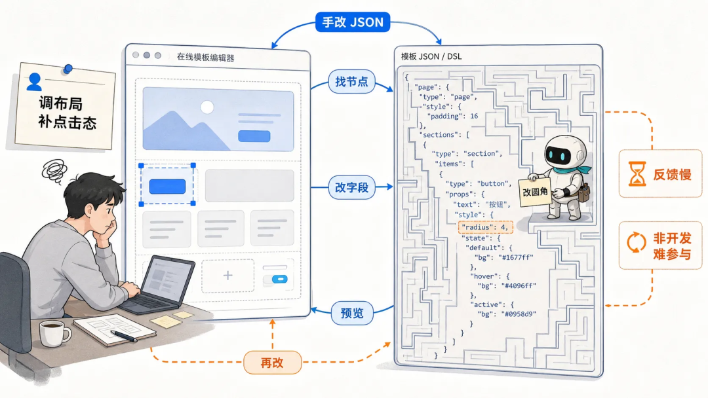
**在 AI 时代，这不是一个优化的开发体验：**
- **非开发同学很难直接参与**，往往一个小改动就需要产品/设计/开发投入人力排期；
- **大量重复劳动**，一个需求往往牵扯到多个模板，每个模板做类似的操作，开发时间会被大量重复性调整占住。
- **视觉调整通常不是一次完成**，需要长期反复调整迭代。
- **规范检查依赖经验**，新人很难快速上手，避免踩过的坑。
能不能让用户用自然语言描述目标，让 Agent 理解当前模板，并直接完成受控修改？
### 01
为什么需要 Agent，而不是 Chat Bot?
如果只是回答问题，一个普通 Chat API 其实就够了。但我们要解决的不是“问答”，而是“让 AI 真的完成一次编辑任务”。
模板编辑天然是一个带状态、带工具、带校验的流程。用户说一句“把按钮圆角调大一点”，背后不只是生成一段文案，而是要让 Agent 真的理解当前模板、找到目标节点、做最小修改、触发预览，并且不能破坏原有的保存审核链路。
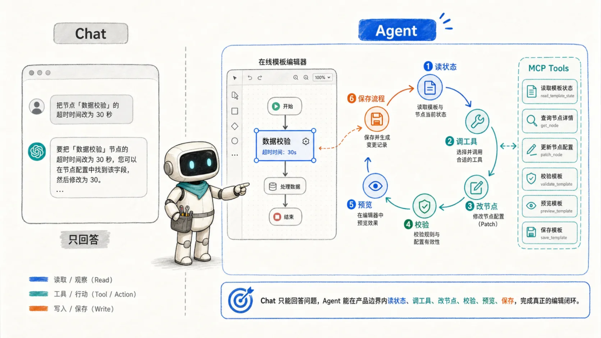
所以，一个真正可用的模板编辑 Agent 至少要能做到：
- 读取当前模板摘要。
- 理解用户提到的节点或当前选中节点。
- 在需求不清楚时多轮澄清，必要的时候读取知识库。
- 调用工具修改局部节点，而不是整棵树乱写。
- 展示修改过程和工具调用状态。
- 失败后能重试。
- 用户能取消长任务。
- 根据团队规则执行检查。
- 修改后仍走原有预览、diff、保存审核流程。
这些能力叠在一起，本质上已经不是“LLM 生成一段 JSON”了，而是一个完整的 Agent 工作流。这也是后面所有技术选择的前提：我们要接入的是一个能**完成任务**的 Agent。
### 02
如何引入 Agent?
明确了要的是 Agent 之后，下一步就是选接入方式。
一开始看起来有很多选择：最容易想到的是直接调模型 API；再进一步，可以自建 Agent Runtime；也可以直接拉起本地 CLI 子进程（codebuddy -p "Hi"）；或者接某个厂商的 Agent SDK（https://www.codebuddy.ai/docs/cli/sdk）。
这些方案都各有优劣，结合我们的场景：**司内 B 端应用，核心用户集中，我们想要“又快又好”的解决方案。** 最好可以直接复用本地已经成熟的 Agent，而不是把在线模板编辑器变成一个自研 Agent 平台。
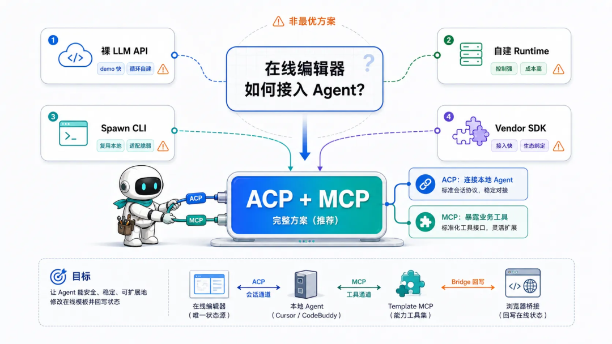
方案
形态
优势
问题
适合度
裸 LLM API
在线应用直接调用模型 API，自己拼 prompt、解析输出
最快做 demo，依赖少
没有完整 Agent 循环；工具调用、权限、会话、重试、上下文管理都要自己做
适合轻量问答
自建 Agent Runtime
自己实现 planning、tool calling、memory、权限、会话
控制力最强
成本最高，需要长期维护 Agent 框架和模型适配
小团队不划算
Spawn 本地 CLI
本地服务直接拉起 Cursor/CodeBuddy CLI，解析输出
复用现成本地 Agent 能力
每个 CLI 的启动、认证、事件格式、工具语义都不同
可行但脆弱
Vendor Agent SDK
接某个厂商提供的 Agent SDK
单一 Agent 接入体验好
绑定单一生态，换 Agent 成本高
适合明确押注单一厂商
ACP + MCP
在线应用通过 ACP 连接本地 coding agent，同时用 MCP 暴露业务工具
标准会话、流式更新、权限、取消、MCP 工具注入；可复用本地 Agent，也能保持业务工具标准化
需要本地 Proxy、CORS/PNA、Session Sandbox、工具 schema
最符合“又快又好”
对比下来，裸 LLM API 和自建 Agent Runtime 都会把大量 Agent 基础设施压回我们自己身上；直接 Spawn 本地 CLI 虽然能复用用户本机的 CodeBuddy/Cursor，但会很快陷入不同 CLI 私有协议的适配成本。
所以我们最终选择的是 **ACP + MCP**：用 ACP 标准化在线应用和本地 Agent 的会话连接，用 MCP 标准化 Agent 能调用的业务工具。这样既能复用成熟的本地 Agent，又不用把在线编辑器改造成一个自研 Agent 平台。
拆开看就是三件事：
- ACP 负责接入本地 Agent。
- MCP 负责暴露业务工具。
- 在线应用仍然拥有自己的业务状态、预览和保存流程。
### 03
等等，ACP 是什么?
ACP 是 Agent Client Protocol，用于标准化 code editors/IDEs 与 coding agents 的通信。它使用 JSON-RPC。典型本地形态是 client 启动 agent 子进程，再通过 stdio 通信。
这个协议最早是由 Zed 编辑器推动并在 Zed Agent Panel 里落地的：Zed 希望编辑器不再为每个 Agent 单独做私有适配，而是像 LSP 连接 language server 一样，通过一套标准协议连接不同 coding agent。后来协议仓库也独立到了 agentclientprotocol/agent-client-protocol，定位就是 “connecting any editor to any agent”。
放到我们的场景里，可以这样对应：
- 在线编辑器承担 ACP Client 角色。
- CodeBuddy/Cursor 是 ACP Agent。
- MCP 用来把在线应用的业务能力暴露给 Agent。
需要注意，业界有其他协议也缩写为 ACP。本文里的 ACP 指的是 agentclientprotocol.com 的 Agent Client Protocol。
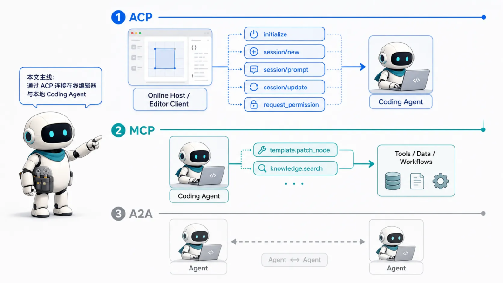
我们不需要一上来就把 ACP 的所有细节都讲完。对这篇文章来说，简单了解下面这几个核心能力就够了：
能力
方法/通知
本文用途
初始化
initialize
协商版本和能力
认证
authenticate
处理 Cursor 或其他 CLI 登录
新会话
session/new
创建 Agent conversation，注入 cwd 和 MCP servers
发起任务
session/prompt
发送用户 prompt
流式进度
session/update
驱动 Agent 面板里的消息、思考、工具调用
session/cancel
中断长任务
权限
session/request_permission
敏感操作前让 Host 授权
恢复
session/load
Agent 支持时恢复历史会话
一句话概括就是：
ACP 是 Agent 和 Client 通信的标准协议，让 Client 可以介入/感知 Agent 认证、权限审批、Session 会话、工具调用等过程。
### 04
Agent 如何修改编辑器状态?
接入之后，Agent 应该怎么修改在线应用里的业务状态呢？我们当时也尝试过几种方案。

### 4.1 让 Agent 直接操作 DOM 或页面函数
###
最直接的想法，是让 Agent 通过 browser eval、页面 API 或隐藏 RPC 改页面。
这个方案看起来简单：改完马上可见。但问题也很明显：
- Vue/React 状态会和 DOM 结果漂移。
- 页面内部实现一变，Agent 工具就坏。
- 权限边界模糊，很难审计“改了什么业务对象”。
所以这条路不能走。它太依赖页面内部实现，也很难回答“Agent 到底改了哪个业务对象”。

### 4.2 把模板 JSON 镜像成本地文件
另一个自然想法是：每个在线会话生成一个本地 session 目录，把当前模板写成 template.json，让 Agent 像改代码一样改文件，再同步回网页。这个方案非常符合 coding agent 的直觉，初期也容易实现。但做下去会发现，浏览器状态和本地文件很容易变成双写源，并继续带来一串问题：
- Agent 容易整文件覆盖，破坏局部 diff。
- dirty flag、保存审核、画布状态可能和文件同步结果不一致。
- 一旦有并发操作或用户手动编辑，就会出现同步竞态。
我们放弃了模板文件镜像。

### 4.3 MCP-only Access
最终我们采用的是 MCP-only Access。
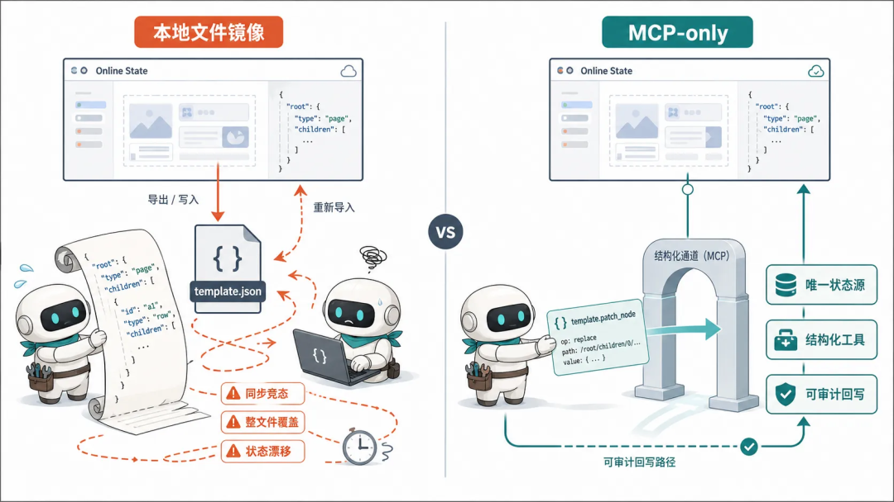
Agent 不直接写 DOM，也不直接写本地模板文件。我们给 Agent 提供理解、变更、校验的结构化 MCP 工具：
- template.get_summary
- template.get_node
- template.get_template
- template.patch_node
- template.insert_child
- template.remove_node
- template.validate
这些工具的实际执行会落回浏览器里的在线编辑器状态。这样做的核心好处是：**在线编辑器依然是唯一业务状态源。**
Agent 可以思考、读取、请求修改，但真正修改模板状态的是在线应用暴露出来的工具。画布、预览、diff、保存审核都还能沿用原来的产品链路。
### 05
整体架构
把前面的选择合起来，最终架构可以拆成几层：
```
Online Template Editor
  |  HTTP / WebSocket to 127.0.0.1
  v
Local Agent Proxy
  |  ACP JSON-RPC over stdio
  v
CodeBuddy / Cursor
  |  MCP tool call
  v
Template MCP
  |  proxy /api/tool/call
  v
Browser Tool Bridge
  |  in-memory state mutation
  v
Online Template Editor
```
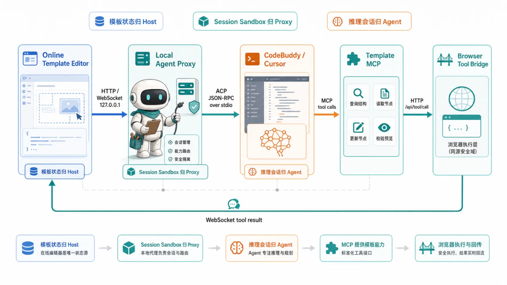
这几层的职责是这样的：
- 在线编辑器：业务状态、画布、保存审核、用户交互。
- 本地 Agent 代理：本地进程生命周期、ACP WebSocket、Session Sandbox、HTTP bridge、MCP 配置生成。
- ACP Agent：推理、多轮任务、工具调用。
- MCP + Browser Tool Bridge：把产品能力暴露给 Agent，但执行权回到浏览器。
这里最重要的边界是：本地 Agent 不是直接拥有模板状态。它通过 MCP 请求修改，Host 决定怎么执行。这样既能复用本地 Agent 的能力，又不会把在线编辑器原有的状态模型打散。
### 06
实现细节补充

### 6.1 一次会话的工作区是怎样的？
本地 Agent 通常期待自己运行在一个“项目目录”里。这个目录里可以有项目说明、MCP 配置、技能文件等。但在线应用不能把真实业务状态随便写成文件让 Agent 改。否则前面好不容易建立起来的“Host 是唯一状态源”又会被破坏。
所以我们为每个编辑器会话创建一个独立的 Session Sandbox，也就是一个专门给本地 Cursor/CodeBuddy 准备的会话工作区，每次对话都是一个全新的目录。
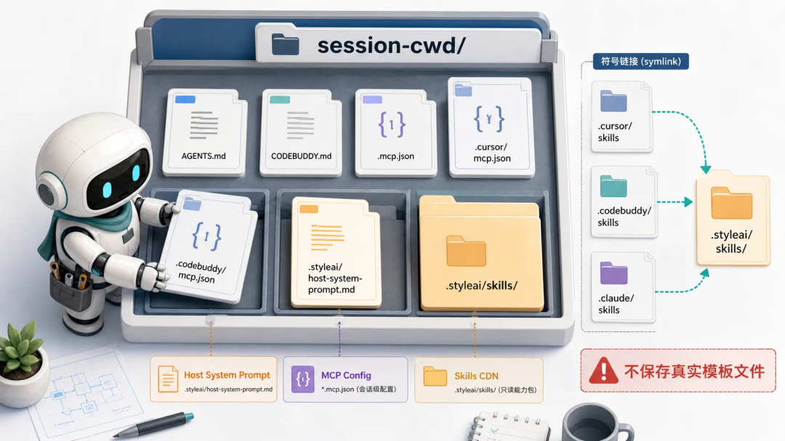
一个 Session Sandbox 大概长这样：
```
session-cwd/
  AGENTS.md
  CODEBUDDY.md
  .mcp.json
  .cursor/
    mcp.json
    skills -> ../.online-agent/skills
  .codebuddy/
    mcp.json
    settings.json
    skills -> ../.online-agent/skills
  .claude/
    skills -> ../.online-agent/skills
  .online-agent/
    host-system-prompt.md
    skills/
      ux-master/
        SKILL.md
        rules/
```
这个目录里有三类关键内容：Agent 要读的系统说明、Agent 要连接的 MCP 工具，以及按需安装的 skills。
### System Prompt
###
应用层需要定义 Agent 在这个在线编辑器里的身份、边界和工作流。工程上可以把它叫做 Host System Prompt。
这部分很关键。因为对 Cursor/CodeBuddy 来说，它默认是在一个代码项目里工作；但在我们的场景里，它真正要服务的是一个在线编辑器。System Prompt 需要把这个身份切换讲清楚：
- 你是在线模板编辑器里的模板 Agent，不是底层 Cursor/CodeBuddy 产品本身。
- 你的任务是友好地解决用户需求；
- 模板是 JSON/DSL 树，节点、样式、children 的基本结构是什么。
- 只能通过 Template MCP 读写模板，不允许读写磁盘里的模板文件。
- 推荐流程是先读摘要，再读节点，最小 patch，校验，最后回复用户。
- skill 文件在 session skills 目录，按路径读取 SKILL.md。
Proxy 在 session 启动时会把这段 System Prompt 写入：
- AGENTS.md
- CODEBUDDY.md
这样这些 Agent 工具自动就会读取系统提示词。同时还会补充当前 session cwd 的说明，明确所有相对路径都相对于这个目录。
### MCP Config
###
只有 prompt 还不够。Agent 还需要知道有哪些工具可以用，所以 Proxy 还会写 MCP 配置，让本地 Agent 在创建会话时能连接 Template MCP。
简化后的配置像这样：
```
{
  "mcpServers": {
    "template": {
      "command": "node",
      "args": ["template-mcp.js"],
      "env": {
        "PROXY_HTTP": "http://127.0.0.1:8090",
        "EDITOR_SESSION_ID": ""
      }
    }
  }
}
```
其中的 EDITOR_SESSION_ID 是会话 ID，MCP 被 Agent 调用时，会带着这个 session id 回到 Local Agent Proxy，再由 Proxy 找到对应的 Browser Tool Bridge。也就是说，Agent 不需要知道浏览器页面在哪里，也不直接调用浏览器。它只调用 MCP。
### Skills
###
除了工具，Agent 还需要领域知识。技能就是团队规则和流程的载体。比如某个 skill 可以告诉 Agent 如何检查点击态、如何修复布局规范、如何处理特定组件。类似的操作封装成技能就可以快速在其他场景下复用。
我们不会把所有 skill 都塞进每次 prompt。一方面上下文会变长，另一方面不同任务需要的规则也不同。更好的流程是：
- 在线输入框展示 slash command。
- 用户选择某个 skill。
- Host 在发送 prompt 前调用 ensureSessionSkills(editorSessionId, skillIds)。
- Proxy 检查 .online-agent/skills/<id>/SKILL.md 是否存在。
- 不存在则下载并安装。
- .cursor/skills、.codebuddy/skills、.claude/skills 都链接到工作区里的同一个 skills 目录。
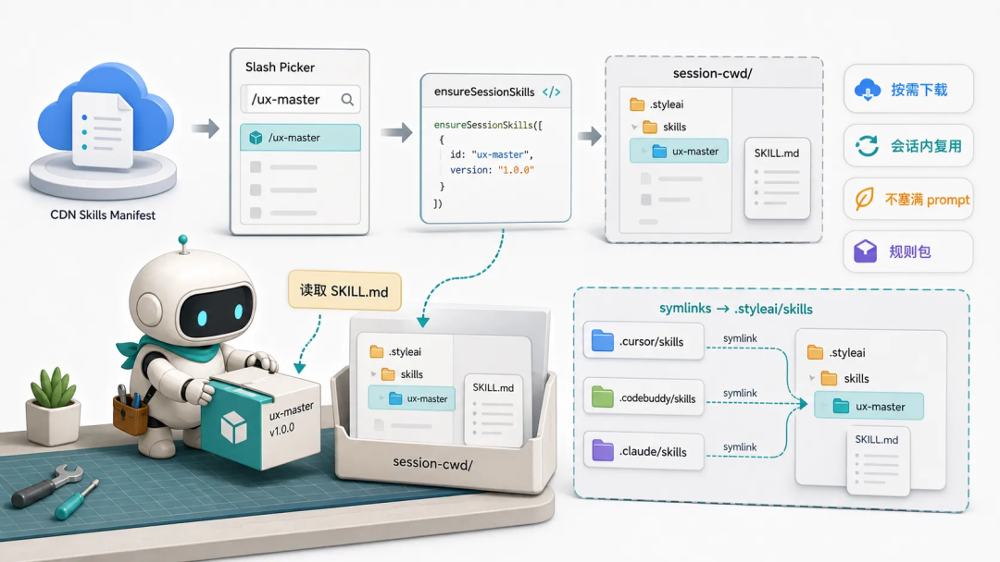
这样做有几个好处：
- 不把所有规则都塞进上下文。
- skill 可以独立发布，实时更新。
- 同一个 session 内已经安装的 skill 可以复用。
- 不同 Agent 可以用自己习惯的 skills 路径。

### 6.2 一次 prompt 的完整链路
现在把前面的组件串起来，看一次用户请求到底发生了什么。
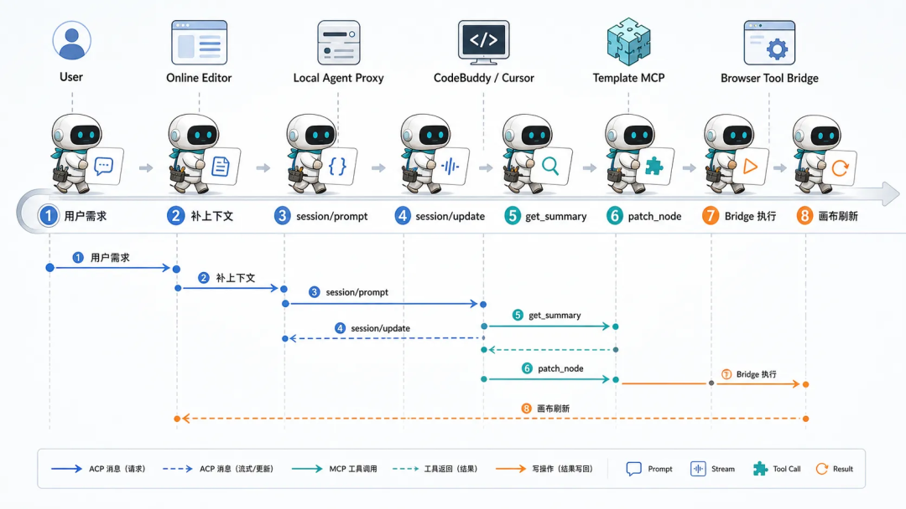
一次用户请求大概会经历这些步骤：
- 在线编辑器中创建 editorSessionId。
- Host 调用 Local Agent Proxy 的 session setup 接口。
- Proxy 创建 Session Sandbox。
- Proxy 写入 MCP 配置、AGENTS.md / CODEBUDDY.md、Host System Prompt、skills 目录链接。
- Browser Tool Bridge 建立 WebSocket，注册 template.* handlers。
- Host 打开 ACP WebSocket。
- Proxy 启动 CodeBuddy/Cursor 子进程。
- Host 调用 initialize / authenticate。
- Host 调用 session/new，传入 cwd 和 MCP servers。
- 用户发送 prompt。
- Agent 通过 session/update 流式回传消息和工具调用状态。
- Agent 调用 Template MCP。
- Template MCP 通过 Local Agent Proxy 找到 Browser Tool Bridge。
- Browser Tool Bridge 调用在线应用注册的工具，修改内存模板状态。
- 在线应用刷新画布，并继续走原有预览、diff、保存审核流程。

### 6.3 直连 Localhost 的工程细节
在线网页要连接用户本机服务，最直接的方式是访问 127.0.0.1。
链路大概是：
- HTTP：http://127.0.0.1:8090/api/*
- WebSocket：ws://127.0.0.1:8090/ws*
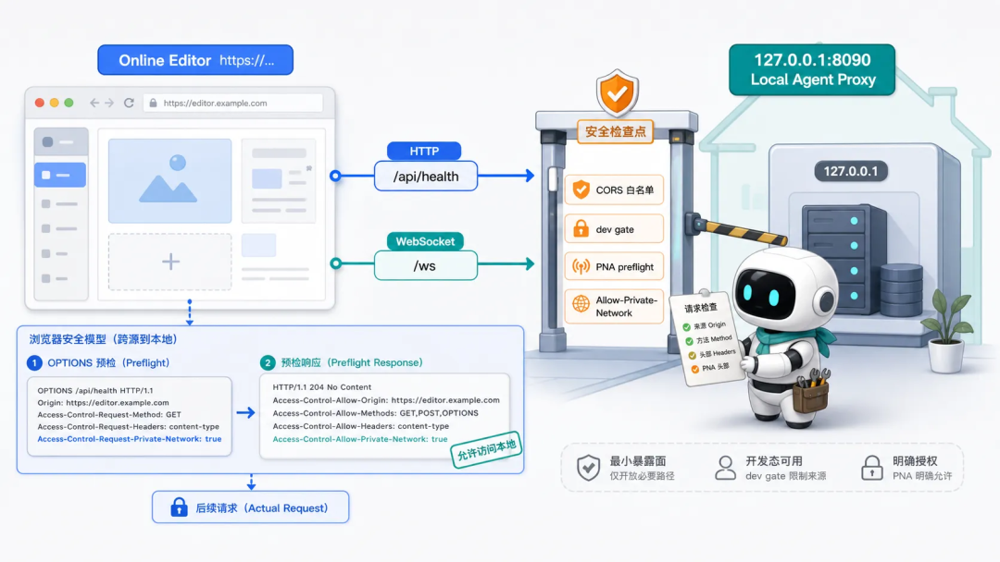
这条链路听起来简单，但有些细节是需要考虑的：
第一是 CORS。Local Agent Proxy 要允许在线应用所在 origin，并返回必要响应头。
第二是 dev gate。请求里可以带一个约定的 header 或 query，避免任意网页随便调用本机 Agent。
第三是 Chrome Private Network Access。线上 HTTPS 页面访问本地网络地址时，浏览器可能发起 PNA preflight。Proxy 需要响应：
```
Access-Control-Allow-Origin: https://online-editor.example.com
Access-Control-Allow-Methods: GET, POST, PUT, OPTIONS
Access-Control-Allow-Headers: Content-Type, x-agent-dev-gate
Access-Control-Allow-Private-Network: true
```
第四是启动体验。启动脚本至少要做：
- 解析最新 Agent 包版本。
- 停掉占用端口的旧进程。
- 启动 Local Agent Proxy。
- 轮询 /api/health。
- 给出明确的“回编辑器重试”提示。
使用 Chrome Private Network Accss 需要 HTTP，我们业务站点还是 http，目前是通过在脚本中加入 whistle 代理来实现的。
### 07
总结
回到标题，如何把本地 CodeBuddy/Cursor 嵌入在线应用？用 ACP 连接并驱动本地 Agent，用 MCP 暴露业务工具，用 Browser Tool Bridge 把工具调用落回在线应用状态，再用 Session Sandbox 给每次对话准备可控上下文。对于司内应用场景，这是一个性价比非常高的 Agent 集成方案。这个模式不只适用于模板编辑器，任何在线应用想接入本地 coding agent 都可以尝试这个方案。前提是，**用户都能接受本地启动一个 Proxy Server。**
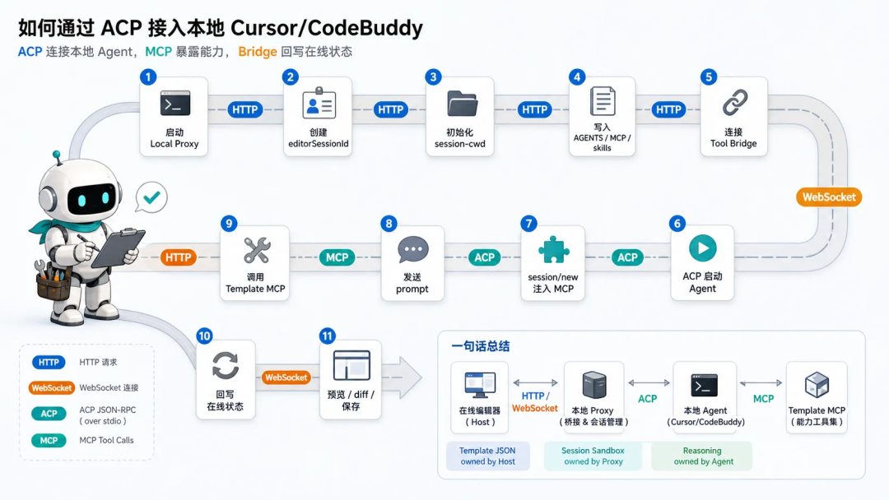
**最后，再演示下我们应用里的最终接入效果**
-End-