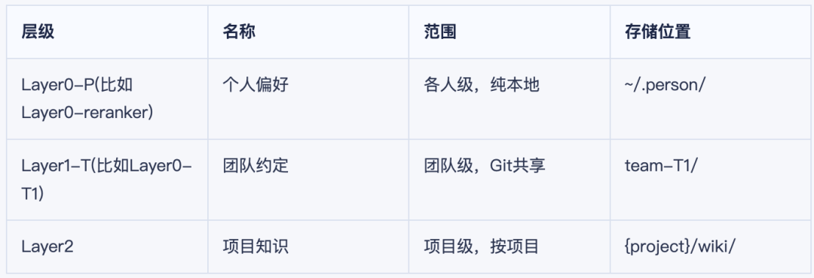

# 一个研究生的硬核教程：把AI真正用进真实项目！

- **来源：** Datawhale
- **作者：** 郭子扬（东南大学研究生）
- **日期：** 2026-06-05
- **原文链接：** https://mp.weixin.qq.com/s/X-34ggGNzJsBaT3-e-9y3Q

---

### AI 写项目像开盲盒，为什么总开出坑？
今年，我们通过VibeCoding写代码，希望能像开泡泡玛特盲盒一样，直接开出完美项目。
但结果往往让人想剁手。
于是，业界开始探索基于SDD、TDD的AICoding范式，希望能减少AI的不确定性。
（相关方法可以参考：成为真正的AI Native Coder，一个研究生实践6个月的思考！）
但现实是：即便是由多位资深工程师精心维护、24小时OnCall对齐的项目，一个新人想上手改动，都需要Landing期（我相信大部分实习、社招朋友都会表示赞同）。
既然人和人协作尚且如此，我们又怎么能幻想：刚来的AI能迅速熟悉你的项目，并做出有效可靠的修改呢？
除非，你的项目对AI很友好。
然而绝大多数传统项目，对AI都是极度不友好的。原因主要有两点：
第一，AI缺乏领域知识：公司内部的核心业务代码从未在GitHub公开过，现有的CodingModel没见过这些代码，自然写不好。
第二，AI不会偿还技术债：项目开发过程中人来人走，文档缺失、代码冗余等技术债导致项目本身已经难理解、难维护，对相关资深开发者都不友好。如果把这样的项目直接丢给AI，它大概率会把技术债做多
但另一面，根据摩尔定律还有各种自研定律，CodingModel会越来越强且越来越便宜，AI参与开发的工作范式也会越来越完善。这就引出了一个深层思考：
在不影响现有业务功能的前提下，我们该如何对已有的项目进行改造？将它改造为一个让人类与AI有效且高效协同的AI-Friendly项目？
这就是接下来要讨论的内容。
### 二、先给 AI 一张说明书，它才看得懂你的项目
大部分项目是：用spec-kit、OpenSpec等开源项目分别开Gitworktree初始化候选文档结构，再根据自己项目的实际情况，合并出最合适的Spec，然后后续基于此来AICoding。
- spec-kit：https://github.com/github/spec-kit
- openspec：https://github.com/Fission-AI/OpenSpec
但已有的项目代码不一定都是好的。基于屎山代码直接生成Spec，只会进一步加重症状。
重构项目成本太大，所以有一个简单的处理办法：让AI从现有代码中反推项目行为，生成待人工Review的草稿，而不是直接生成正式Spec。推荐用以下ABCD四类整理现有项目行为（用符号标号方便人工打标）：
- A类：已经实现，确认要保留的
- B类：已经实现，但不确定是否合理，需要人工判断取舍
- C类：已经实现，但可能是临时代码、偶然产物或废弃逻辑，要清理出spec（代码可以保留），避免AI学坏
- D类：还没实现，未来想新增或重构的增量需求
这样让AI负责发现事实，人负责确认意图。人类Review后再形成正式Spec，然后就是大家熟悉的sddcoding了
### 三、建团队知识库，让 AI 和人共享项目的知识
之前的项目只有readme文件，告诉新人如何开始使用。
我认为团队协作需要有一个知识库，让大家可以共享项目所有的上下文，而不是想到了再找同事拉会对齐（而且不知道项目所有上下文的话，很多问题都想不到）
以下是个人的实践设计，仅供参考
### 1、知识库数据设计
为什么要分层？因为不同范围的知识应该有不同的共享边界。可以参考这三层结构(参考知识库文档嵌套的设计)：

其中有一个关键设计：知识可以向上提升。
比如Layer2的部分项目知识，如果大家认为是跨项目通用的、对个人可用性很强，可以提升到Layer1或Layer0。
### 2、知识库权限设计
团队知识库应该是一个独立的Git仓库，不依赖任何业务项目。好处：
1. 跨项目共享：同一团队的多个项目连接同一个知识仓库，项目A沉淀的知识，项目B自动受益
2. 生命周期独立：业务项目可能归档或重构，但知识不应该跟着消失
3. 权限独立：知识库的贡献和消费权限可以独立于代码仓库管理
参考维护开源项目的经历，推荐知识库成员角色分三种：
- Maintainer：团队负责人，管理成员+Merge
- Contributor：正式成员，push产出内容
- Reader：新成员，只pull看内容，pr被merge后晋升为Contributor
### 3、知识库使用设计
知识库不能靠人去手动更新（无脑增加工作量并不适合刚开始探索这种工作模式的团队），我认为应该是嵌入AICoding的阶段：
INIT阶段（知识注入）：agents.md中注入团队知识库的使用方式，这样cc、codex启动后，自动能够触达相关知识。
执行阶段（知识消费）：我个人认为这里一个skill就够了，不需要rag知识库提供上下文（可能不够相关），老师傅手写skill介绍什么情况使用什么知识库。比如技术分析时查有没有类似的架构决策，架构设计时查有没有已知的模式。
ARCHIVE阶段（知识提取）：完成酣畅淋漓的AICoding后，让AI从该会话中提取知识条目，根据权限注入知识库（前提需要根据自己项目探索具体的提取逻辑还有知识库更新逻辑，确定后封装为skill，感觉这个skill也不用经常维护）
### 4、知识库展示形式
spec是给ai看的，也需要生成给人看的Wiki类信息，前段时间大家在讨论html比markdown更适合给人看，我深表赞同。
具体风格根据个人喜好：DeepWiki流派的文档+架构图，或者Graphify流派的可交互图谱，都是不错的选择。
### 四、装上质检关，AI 改完你才敢直接上线
对AI Coding出来的项目，项目管理的核心应该从是否管转向如何管。
推荐这样的团队协作模式：RD前置输出标准化Spec文档，明确功能逻辑、数据流转、接口约束、异常处理及边界场景，为测试设计提供清晰输入。然后QA基于Spec快速生成高覆盖度测试Case(包含Unit/ITP/E2E多种测试任务)，提前识别核心验收标准和潜在风险点。
其中我认为E2E任务，任务最重要，因为AI写静态代码能力很强了，基本不会出错，但是无法写出正确的动态交互代码。比如它几乎不会考虑，"点击题单，必须成功加载出对应的题目"这种端到端的业务逻辑。
最后，Agent的效果评测比传统软件更难——输入空间近乎无限且离散，LLM对提示词高度敏感，Agent输出差异性极大。目前很多团队主要依靠人工审查和LLM打分，还在探索自动化评测体系。插入私货，很推荐大家开发过程中使用两个指标：
- Pass@k（k次至少一次正确）：适合开发阶段探索这个需求Agent能不能做到
- Pass^k（k次全部正确）：适合上线前回归测试已有功能有没有被改坏
从零构建AgenticTest成本并不高，通过这种自动化测试，可以降低开发者Review AI Coding项目压力。
而且对项目而言，完善的测试体系是宝贵的不动产。对个人而言，你完善的测试体系被更多人使用也是很好的工作（ld认不认是另一回事了）。
### 五、要把能自动化的事，真正交给 AI
软件工程过去五十年其实没真正工程化过，
它一直停留在人工阶段，被各种方法论包装成工程，但离不开人。
这一点直到大模型出现才开始有可能改变。
看看其他工程——机械、化工、电力、自动化、通讯，这些工程可以靠消耗能源完全代替人工，且同样的输入、同样的能源，输出是稳定可预期的。所以说工程化很成功。
但软件工程要做的事情是抽象、分解、推理——这些无法用机器去做。比如代码是用人的思维一行一行编出来的，编译器这个机器只是忠实地翻译，从不理解需求。而人的思维难免误解、遗漏、不一致，这就导致了绵延半个世纪的软件危机。
回顾过去五十年的方法论——结构化编程、面向对象、敏捷、Scrum、DevOps——它们的解决方式都是：管理人的确定性，但没改变必须靠人这个事实。
不过，这五十年沉淀下来一整套东西：编译器、类型系统、单元测试、CI/CD、灰度发布、契约编程、形式化方法、静态分析、覆盖率、监控、链路追踪。这套东西虽然没让软件工程真正工程化，但它们留下了一整套自动化验证基础设施。
现在AI基于这套设施，能够代替一部分人力了。
软件工程，真正有可能成为工程了。
以上是项目AI-Friendly化的理论思考。
### 写在最后
聊一点个人想法：AI时代，优秀的人应该是什么样子的？
我认为是在生活中，每遇到一个问题，都会思考：能不能用AI把这件事自动化？并且逐步用AI提高生活效率。
参考编程经验，我推荐这个实现路径分三步：
第一步：先尝试跑通：让AI在脱离人参与的情况下做整件事，看结果咋样。重点是无脑验证可行性。
第二步：再总结SOP：如果结果能稳定复现（比如每次跑都一样好），就让Agent自己回顾成功案例，把操作步骤归纳成SOP。本质是在管理不确定性。
第三步：思考能否泛化：把总结出的流程拿去处理同类但不同的任务，如果也能成功，说明这套方法真有效，之后可以让Agent在脱离自己的情况下处理。
这其实就是一种自动化思维：每天问自己，今天有没有做重复性的事情？能不能用AI来自动化？
脑子里可能只有一个模糊的想法，甚至无法用自然语言描述的闪念——没关系。
记录下来，迅速和AI聊聊，和Datawhale群友聊聊（偷偷推广一下Datawhale各种社群，里面真有很多无偿答疑解惑的大佬）。
现在这个时代，缺的是想法而不是实现。
这种从自己的经历中，提炼想法，并迅速实现的能力——个人认为，这是我们在Agent时代很重要锻炼的。
这篇博客相关实践因此而来。
---
以上所有内容，欢迎评论区交流，任何提问都会回。
如果文字不足以传达，我们可以拉会聊。
就业如长夜，暗沉高难问。
长夜中群星璀璨，彼此照亮或可熠熠生辉。
虽然当知识博主，难免追求Build in Public。
但这份求学共进之心，万望怜见。
